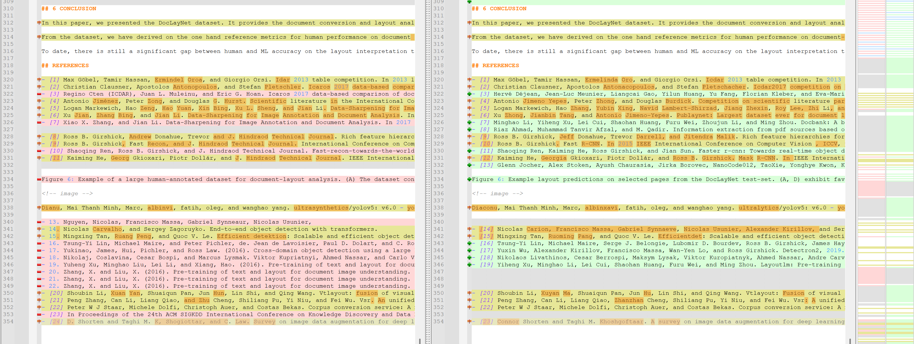
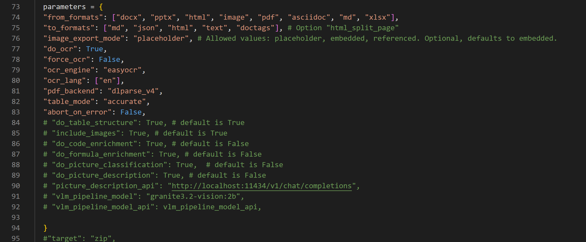
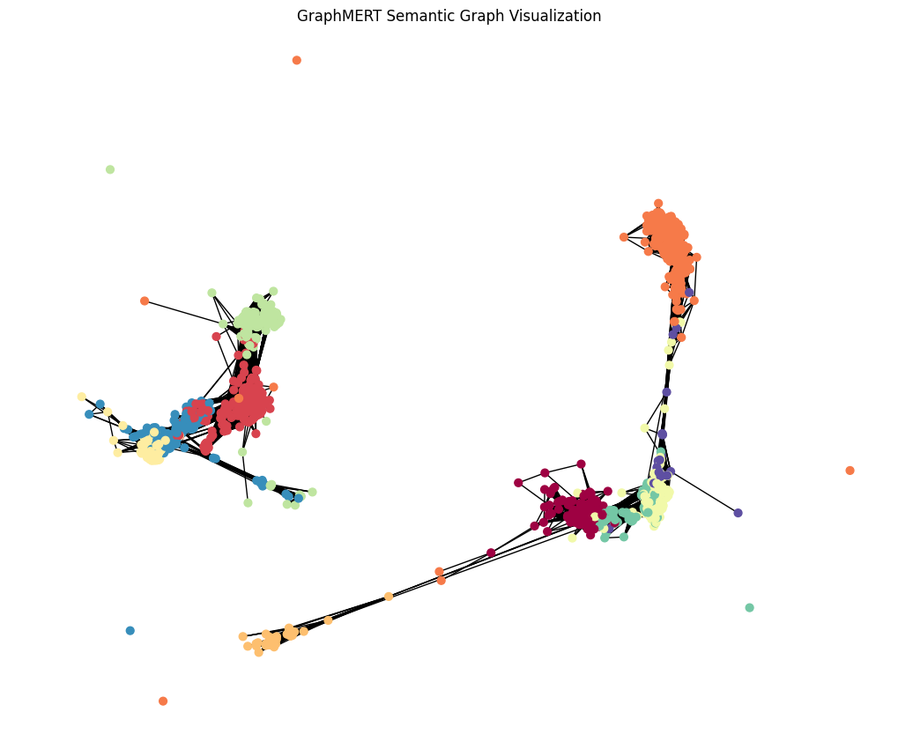

# Projektbericht: IMARA

**Modul:** Abschlussarbeit CAS Machine Learning for Software Engineers (ML4SE)

**Datum:** 17.01.2026

**Autoren:** Marco Allenspach, Lukas Koller, Emanuel Sovrano

---

## Abstract

Die Einführung von Retrieval-Augmented Generation (RAG) markierte einen bedeutenden Meilenstein in der Anwendung grosser Sprachmodelle (LLM), indem generative Fähigkeiten auf faktischen, externen Daten basierten, um Fehlinterpretationen zu vermeiden und die Relevanz zu erhöhen. Um die Schwächen von RAG der ersten Generation durch die Einführung strukturierter, relationaler Kontexte zu beheben, hat sich jedoch mit AI-Native GraphRAG ein weiterentwickeltes Paradigma etabliert.

Das IMARA-Projekt zielt darauf ab, diese Entwicklung praktisch zu untersuchen. Traditionelle neuronale Netze eignen sich gut zur Kodierung linearer Beziehungen, doch Daten aus der realen Welt sind in der Regel komplex und multidimensional. Graphen sind besser geeignet, höherdimensionale Verbindungen darzustellen. Im Rahmen dieser Arbeit wurde eine Pipeline zur Extraktion von Wissen aus komplexen PDF-Dokumenten und deren Überführung in graph-basierte RAG-Systeme (GraphRAG, LinearRAG) implementiert. Die Evaluation zeigt, dass strukturierte Wissensgraphen zwar die Komplexität der Datenverarbeitung erhöhen, jedoch bei "Multi-Hop"-Reasoning Aufgaben Vorteile gegenüber rein vektorbasierten Ansätzen bieten können.

## 1. Einleitung

Das IMARA-Projekt (Domain-specific GraphRAG pipeline with model fine-tuning) hat zum Ziel, aufzuzeigen wie die Genauigkeit der Abfrage eines graph-basierten RAG-Systems sich verbessert. Um eine Grundlage für die Messbarkeit zu haben, wurde OpenRAGBench als Referenzdatensatz ausgewählt.

### 1.1 Problemstellung

Die Extraktion und Verarbeitung von Informationen aus unstrukturierten PDF-Dokumenten stellt eine Herausforderung für herkömmliche RAG-Systeme dar. Konventionelle Architekturen behandeln Wissen oft als Sammlung unzusammenhängender Fakten, was bei komplexen Fragestellungen, die eine Synthese aus mehreren Quellen erfordern, zu Schwierigkeiten führt.

### 1.2 Projektziele

Das Projekt verfolgt folgende Ziele:
- Die Implementation eines graphbasierten Systems und der Vergleich zu klassischen RAG-Systemen.
- Der Vergleich zwischen verschiedenen graphbasierten RAG-Systemen.
- **Graph-basiertes RAG:** Aufbau einer Pipeline zur Erstellung dichter Wissensgraphen.
- **Model Fine-tuning:** Optimierung eines LLMs (z.B. Qwen) basierend auf dem Graph.
- **Automation:** End-to-End Automatisierung der Pipeline. Aufbau einer flexiblen Pipeline, die bei der Evaluation der verschiedenen RAG-Systeme unterstützt.

## 2. Stand der Technik

In diesem Kapitel werden die theoretischen Grundlagen und die wissenschaftliche Literatur vorgestellt, die als Basis für die implementierten Lösungen dienten.

### 2.1 LeanRAG Ansatz

Der LeanRAG Ansatz konzentriert sich auf die Reduktion von Redundanzen durch semantische Aggregation.
- **Semantic Aggregation**: Clusters entities into semantically coherent summaries and constructs explicit relations to form a navigable aggregation-level knowledge network.
- **Hierarchical, Structure-Guided Retrieval**: Initiates retrieval from fine-grained entities and traverses up the knowledge graph to gather rich, highly relevant evidence efficiently.
- **Reduced Redundancy**: Optimizes retrieval paths to significantly reduce redundant information—LeanRAG achieves ~46% lower retrieval redundancy compared to flat retrieval baselines (based on benchmark evaluations).

Referenz: [2] LeanRAG: Knowledge-Graph-Based Generation.

### 2.2 LinearRAG

LinearRAG ("Linear Graph Retrieval-Augmented Generation on Large-scale Corpora") ist eine Methode zur effizienten Graph-Konstruktion ohne explizite Relationen ("relation-free").

Wesentliche Merkmale sind:
- **Context-Preserving**: Relation-free graph construction, relying on lightweight entity recognition and semantic linking to achieve comprehensive contextual comprehension.
- **Complex Reasoning**: Enables deep retrieval via semantic bridging, achieving multi-hop reasoning in a single retrieval pass without requiring explicit relational graphs.
- **High Scalability**: Zero LLM token consumption, faster processing speed, and linear time/space complexity.

Referenz: [3] LinearRAG: A relation-free graph construction method for efficient GraphRAG.

### 2.3 GraphMERT

GraphMERT adressiert das Problem der Skalierbarkeit bei neurosymbolischen KI-Frameworks. Seit fast drei Jahrzehnten erforschen Wissenschaftler Anwendungen neurosymbolischer künstlicher Intelligenz (KI), da symbolische Komponenten Abstraktion und neuronale Komponenten Generalisierung ermöglichen. GraphMERT ist ein kompaktes, rein grafisches Encoder-Modell, das hochwertige KGs aus unstrukturierten Textkorpora und seinen eigenen internen Repräsentationen generiert.

GraphMERT und sein äquivalenter Wissensgraph bilden einen modularen neurosymbolischen Stack: neuronales Lernen von Abstraktionen; symbolische Wissensgraphen für verifizierbares Schliessen. GraphMERT + Wissensgraph strebt an, das erste effiziente und skalierbare neurosymbolische Modell zu sein, das höchste Benchmark-Genauigkeit und überlegene symbolische Repräsentationen im Vergleich zu Basismodellen erzielt.

Referenz: [4] GraphMERT: Efficient Distillation of Reliable KGs.

## 3. Hintergrund

### 3.1 Vektorbasiertes (Naives) RAG und seine Grenzen

Konventionelle RAG-Architekturen verlassen sich auf Vektorsimilaritätssuche über ein Korpus von geteiltem Text. Dieser Ansatz behandelt Wissen als eine Sammlung von unzusammenhängenden Fakten und hat Schwierigkeiten mit Fragen, die erfordern:
- Synthese von Informationen aus mehreren Quellen
- Verständnis nuancierter Beziehungen zwischen Entitäten
- Durchführung von Multi-Hop-Reasoning

Der Kontext, der dem LLM bereitgestellt wird, ist oft eine Liste von Textausschnitten, die keine explizite Darstellung ihrer Verbindungen enthalten. Das Chunking bricht den natürlichen Informationsfluss willkürlich. Die Vektorsuche versteht semantische Ähnlichkeit, ist jedoch blind für explizite Beziehungen wie Kausalität, Abhängigkeit oder Hierarchie.

Eine einfache Vektorsuche ist unwahrscheinlich in der Lage, Informationssprünge zu überbrücken (z.B. Störung → betroffene Produkte → Marketingkampagnen).

### 3.2 Das "AI-Native" GraphRAG Paradigma

AI-Native GraphRAG repräsentiert ein weiterentwickeltes Paradigma. Der rasante branchenweite Wandel hin zu graphenbasierten Architekturen beruht auf der Erkenntnis, dass eine KI für effektives Denken ein Modell des Anwendungsbereichs benötigt, nicht nur eine Sammlung von Fakten. Ein Wissensgraph liefert diese Struktur und transformiert eine passive Dokumentensammlung in ein aktives, abfragefähiges Modell der Welt.

Lösungen müssen den gesamten Workflow von unstrukturierten Daten bis zu einer natürlichsprachlichen Antwort automatisieren und dabei die Komplexität von Graphentheorie und Datenbankmanagement abstrahieren.

**Analogie:** Vektorbasierte RAG bietet einem Forscher einen Stapel isolierter Karteikarten, während GraphRAG darauf abzielt, eine umfassende Mindmap zu erstellen und bereitzustellen, die entscheidende Verbindungen aufdeckt.

## 4. Methodik / Umsetzung

Dieses Kapitel beschreibt das methodische Vorgehen, von der Datenbeschaffung über die Extraktion bis zur Implementierung der Pipeline.

### 4.1 Datenbasis

Als Grundlage für die Evaluation wurden verschiedene Datensätze verwendet:
- **Open RAG Bench Dataset**: Ein Korpus wissenschaftlicher Publikationen (Arxiv).
- **2wikimultihop**: Für Multi-Hop Question Answering Tests.
- **PubMedQA** / Medical Datasets: Für domänenspezifische Tests.

### 4.2 PDF-Extraktion mit Docling

Für die Konvertierung der Dokumente in maschinenlesbare Formate (Markdown/JSON) wurde das **Docling Toolkit** eingesetzt.

#### Herausforderungen und Design-Entscheidungen

**Parameter-Optimierung:** Die Qualität der Ergebnisse lag initial unter den Erwartungen. Durch Optimierung der Parameter konnte die Geschwindigkeit erhöht und die Genauigkeit massiv verbessert werden (siehe Abb. Differenzen).

**Ressourcen-Management (VRAM):** 16GB VRAM waren nicht ausreichend, um alle Features von Docling zu unterstützen, was zu "Endless-loops" führte.
*   *Entscheidung:* Verzicht auf die Container-Version ("Docling serve") und Nutzung direkt in Python.
*   *Entscheidung:* Ausführung auf der CPU, um das VRAM-Limit zu umgehen.

**Hintergrundprozesse:** Die `cloudcode_cli.exe` in der VSCode-Umgebung verhinderte durch extremen RAM-Verbrauch die Ausführung. Ein Uninstall war unumgänglich.

**Laufzeit:** Da das Parsen von Formeln sehr rechenintensiv ist, wurde ein dedizierter zweiter Rechner für die Extraktion eingesetzt (Laufzeiten bis zu 369919 Sekunden für Batches).

### 4.3 Systemarchitektur

Die IMARA Pipeline automatisiert den Fluss von der PDF-Eingabe bis zur Antwortgenerierung.

#### Hardware Setup
Die Durchführung erfolgte auf folgender Hardware:
*   **Extraktion (Docling):** HP EliteBook X G11 (Intel 5U).
*   **Training/Inference:** Lenovo Notebook Legion 9 16IRX8, Intel i9-13980HX, 32GB RAM, **Nvidia RTX4090 Mobile (16GB VRAM)**.

### 4.4 Graph-Konstruktion (LinearRAG Implementation)

Die Implementierung von Linear RAG im IMARA-Projekt zielt darauf ab, die theoretischen Vorteile – lineare Komplexität und Kontextbewusstsein – in eine performante Pipeline zu überführen.

#### 4.4.1 Datenaufbereitung & Loading
Der Loading-Prozess (`load.py`) stellt Idempotenz sicher, indem für jeden Chunk ein deterministischer MD5-Hash generiert wird. Die Datenbasis wird in der PostgreSQL-Tabelle `document_chunk` persistiert.

#### 4.4.2 Graph-Erstellung
Die Erstellung erfolgt "On-the-Fly" ohne teure LLM-Aufrufe mittels **scispaCy**.
Es werden drei Knotentypen konstruiert:
1.  **Passage Nodes**: Vollständiger Text-Chunk.
2.  **Sentence Nodes**: Untereinheiten.
3.  **Entity Nodes**: Benannte Entitäten (via Spacy-NER).

Kantentypen:
*   Passage ↔ Entity (gewichtet nach TF-IDF).
*   Structural Containment (Gewicht 1.0).
*   Sequential Adjacency (Passage ↔ Passage).

#### 4.4.3 Hybrid Retrieval Algorithmus
Die Retrieval-Logik (`retrieve.py`) implementiert einen hybriden Ansatz:
1.  **Query Analysis**: Extraktion von Seed-Entitäten aus der Frage.
2.  **Candidate Generation**: Vektorähnlichkeitssuche (Embedding mit Google Gemini `text-embedding-004` oder Ollama `bge-m3`).
3.  **Graph Expansion & Scoring**: Nutzung eines **Personalized PageRank** Algorithmus zur Propagierung von Relevanz im Graphen.

### 4.5 Evaluierungs-Design

Für die Evaluierung mittels **OpenRAGBench** wurde ein Graph basierend auf 1001 wissenschaftlichen Publikationen erstellt. Als Evaluator kam der `TRECEvaluator` in Kombination mit `Gemini-2.5-flash` zum Einsatz.

## 5. Resultate

### 5.1 Linear RAG Graph Metriken

Die folgende Tabelle zeigt die Metriken des erstellten Graphen für den OpenRAGBench Datensatz (1001 Papers).

| Metrik | Wert | Beschreibung |
| :--- | :--- | :--- |
| **Rohdaten** | | |
| Anzahl Dokumente | 1,001 | Korpusgrösse |
| Passages (Chunks) | 278,692 | Erzeugte Textabschnitte |
| **Extraktion (scispaCy)** | | |
| Extrahierte Sätze | 1,198,328 | Sentence Units |
| Eindeutige Entitäten | 596,824 | Unique Nodes im Graphen |
| **Graph Topologie** | | |
| **Graph Nodes (Total)** | **1,751,262** | Summe Nodes |
| **Graph Edges (Total)** | **7,370,454** | Verbindungen |

### 5.2 Retrieval Ergebnisse (LinearRAG)

Nachfolgend die Ergebnisse der Evaluationsläufe auf verschiedenen Datensätzen.

**Dataset: 2wikimultihop** (Vergleich Modelle)
*   *Local GPT-OSS-20b*: LLM Accuracy: **0.735**, Contain Accuracy: **0.721**
*   *Online gpt-4o-mini*: LLM Accuracy: **0.639**, Contain Accuracy: **0.693**
*   *Online gpt-4o*: LLM Accuracy: **0.590**, Contain Accuracy: **0.755**
*   *Remote gemma3:17b*: LLM Accuracy: **0.240**, Contain Accuracy: **0.351**

**Dataset: hotpotqa**
*   *Local GPT-OSS-20b*: LLM Accuracy: **0.771**, Contain Accuracy: **0.662**

**Dataset: musique**
*   *Local GPT-OSS-20b*: LLM Accuracy: **0.642**, Contain Accuracy: **0.317**

**Dataset: medical**
*   *Local GPT-OSS-20b*: LLM Accuracy: **0.694**, Contain Accuracy: **0.032**

### 5.3 GraphMERT Visualisierungen

**GraphMERT Node Embeddings (t-SNE View)**

**GraphMERT Semantic Graph Visualization**

**Query Search Resultat (Beispiel)**

## 6. Diskussion

<!-- TODO: In diesem Kapitel müssen die Resultate interpretiert werden. 
     Fragen zur Beantwortung:
     1. Warum ist Gemma3:17b so schlecht (0.240) im Vergleich zu GPT (0.735)? 
     2. Was bedeutet die niedrige Contain Accuracy (0.032) beim Medical Dataset bei gleichzeitig hoher LLM Accuracy? (Halluzination vs. Wissen im Modell?)
     3. Wie bewerten wir die hohe Dichte des Graphen (7.3M Edges) in Bezug auf Performance?
     4. Diskussion der Docling-Probleme: War der Aufwand für Formel-Parsing gerechtfertigt?
-->
*Hier muss der interpretative Text eingefügt werden. Die reinen Daten befinden sich in Kapitel 5.*

## 7. Conclusion / Fazit

<!-- TODO: Zusammenfassung der Arbeit.
     - Wurde das Ziel erreicht (Vergleich RAG Systeme)?
     - Funktioniert die Relation-free Extraction (LinearRAG) gut?
     - Ist der Aufwand für GraphRAG gerechtfertigt?
-->
*Zusammenfassendes Fazit der Arbeit.*

### 7.1 Persönliches Fazit

<!-- TODO: Persönliche Reflexion der Autoren.
     - Was lief gut?
     - Was wurde gelernt? (z.B. Hardware-Grenzen, Tooling wie Docling)
-->
*Reflexion über den Arbeitsprozess.*

---

## 8. Glossar

### A - C
* **AI-Native GraphRAG:** Ein weiterentwickeltes Paradigma von GraphRAG, das den gesamten Workflow automatisiert und Graphentheorie abstrahiert.
* **Chunking:** Zerlegen von Texten in kleinere Abschnitte. Kritischer Faktor für RAG-Performance.
* **CommonKG:** Methode zur Erstellung von Wissensgraphen durch Triple-Extraktion aus Chunks.

### D - G
* **Docling:** Toolkit zur Dokumentenkonvertierung.
* **Embeddings:** Vektorrepräsentationen von Texten.
* **FActScore:** Metrik zur Bewertung der faktischen Korrektheit.
* **Fine-tuning:** Nachtrainieren eines LLMs auf spezifischen Daten.
* **GraphMERT:** Neurosymbolisches Encoder-Modell für zuverlässige Wissensgraphen.
* **GraphRAG:** Retrieval-Augmented Generation mit strukturierten Wissensgraphen.

### H - L
* **Hypergraph:** Graphenstruktur, bei der Kanten mehr als zwei Knoten verbinden können.
* **IMARA:** Projektname (Domain-specific GraphRAG pipeline).
* **Knowledge Graph:** Strukturierte Darstellung von Wissen (Knoten & Kanten).
* **LeanRAG:** GraphRAG-Ansatz mit semantischer Aggregation.
* **LinearRAG:** "Relation-free" GraphRAG-Methode mit linearer Komplexität.
* **LLM:** Large Language Model.

### M - O
* **Multi-Hop-Reasoning:** Verknüpfung von Informationen über mehrere Schritte.
* **Naives RAG:** Vektorbasiertes RAG (Baseline).
* **Neurosymbolische KI:** Kombination aus neuronalen Netzen und symbolischer KI.
* **OpenRAGBench:** Referenzdatensatz für Benchmarks.

### S - V
* **Semantic Aggregation:** Gruppierung von Entitäten in Cluster (LeanRAG).
* **Synthetic Data Generation (SDG):** Generierung künstlicher Testdaten.
* **Unsloth:** Framework für ressourceneffizientes Fine-tuning.
* **ValidityScore:** Metrik zur Bewertung der Relationen-Gültigkeit.
