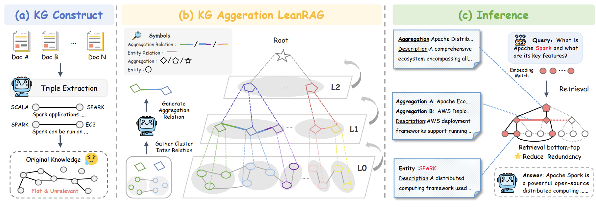
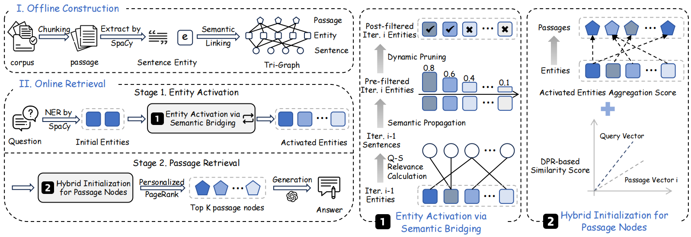
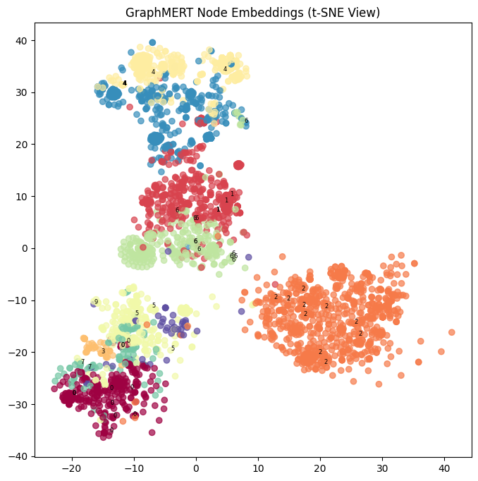
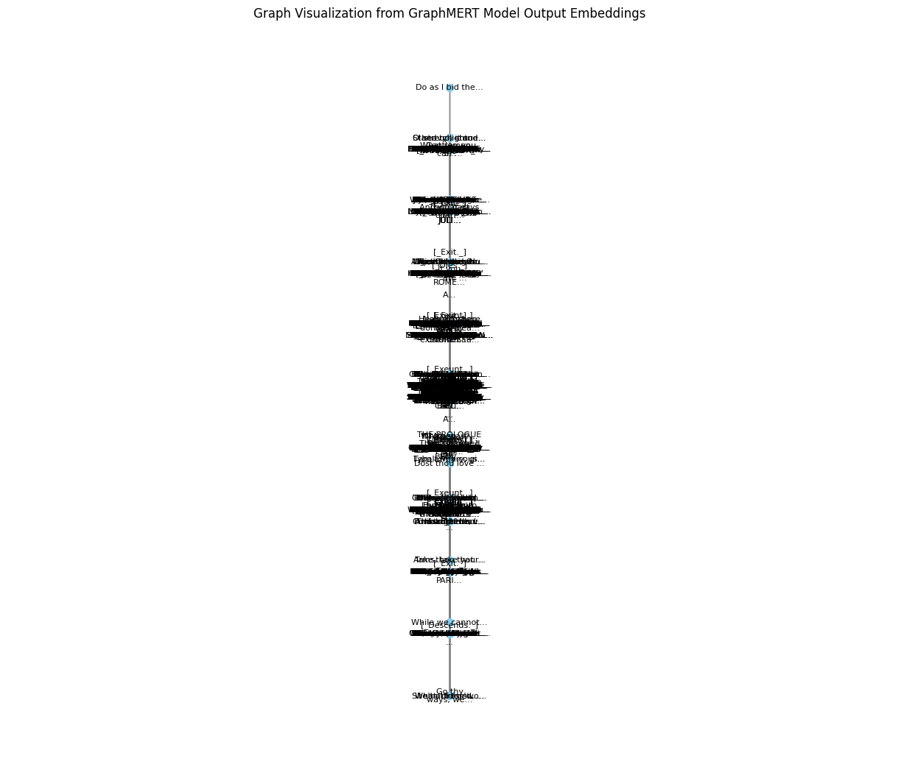
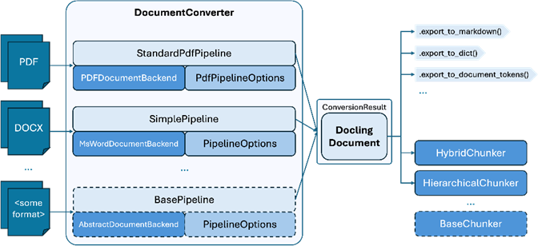
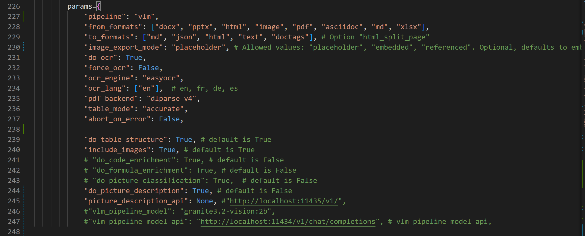
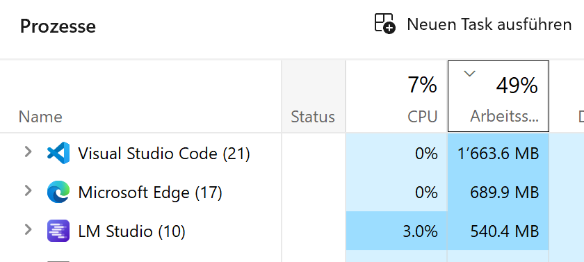

# Projektbericht: IMARA

**Modul:** Abschlussarbeit CAS Machine Learning for Software Engineers (ML4SE)

**Datum:** 18.01.2026

**Autoren:** Marco Allenspach, Lukas Koller, Emanuel Sovrano

---

## Abstract

Die Einführung von Retrieval-Augmented Generation (RAG) markiert einen bedeutenden Meilenstein in der Anwendung grosser Sprachmodelle (LLM), indem generative Fähigkeiten auf faktischen, externen Daten basieren. Klassische, rein vektorbasierte RAG-Systeme behandeln Wissen jedoch als Sammlung unzusammenhängender Textfragmente und stossen bei komplexen Anfragen an Grenzen – insbesondere, wenn Informationen aus mehreren Quellen zu verknüpfen sind oder explizite Beziehungen zwischen Entitäten eine Rolle spielen.

Der rasante branchenweite Wandel hin zu graphenbasierten Architekturen ist eine notwendige
Weiterentwicklung, die auf der Erkenntnis beruht, dass eine KI für effektives Denken ein Modell des
Anwendungsbereichs benötigt, nicht nur eine Sammlung von Fakten. Der Fortschritt von unreflektierten LLMs
zu grundlegenden RAGs löste das Problem der faktischen Fundierung, doch das Versagen rein vektorbasierter
RAGs bei komplexen Anfragen zeigte, dass die Struktur des Wissens ebenso wichtig ist wie sein Inhalt. Ein
Wissensgraph liefert diese Struktur und transformiert eine passive Dokumentensammlung in ein aktives,
abfragefähiges Modell der Welt.

---

## 1. Einleitung

Das Projekt IMARA verfolgt das Ziel, die Grenzen klassischer RAG-Systeme aufzuzeigen und zu untersuchen, inwiefern graphbasierte Retrieval-Ansätze die Antwortqualität insbesondere bei komplexen, mehrschrittigen Anfragen verbessern können. Ausgangspunkt ist ein realitätsnahes End-to-End-Szenario: Ausgehend von komplexen, wissenschaftlichen PDFs (z. B. aus OpenRAGBench) werden Dokumente automatisch extrahiert, in eine Wissensrepräsentation überführt und schliesslich für Frage-Antwort-Szenarien genutzt.

Zur Standardisierung der Evaluation werden OpenRAGBench als Datensatz und OpenRAG-Eval als Evaluations-Framework eingesetzt. Damit lassen sich unterschiedliche Konfigurationen – naives RAG, verschiedene GraphRAG-Varianten und später feinabgestimmte Modelle – unter vergleichbaren Bedingungen messen.

### 1.1 Problemstellung

Konventionelle RAG-Architekturen basieren typischerweise auf Vektorsimilaritätssuche über in Chunks zerlegte Dokumente. Dieser Ansatz weist folgende zentrale Schwächen auf:

- Wissen wird als Menge von isolierten Textausschnitten behandelt.
- Beziehungen zwischen Entitäten (Kausalität, Abhängigkeit, Hierarchie) sind implizit und für das System nicht explizit erfassbar.
- Multi-Hop-Reasoning (z. B. Verknüpfung mehrerer Dokumente/Abschnitte) ist schwierig.
- Die Performance ist stark abhängig von der gewählten Chunking-Strategie (Grösse, Überlappung, Heuristiken).

Gerade wissenschaftliche Publikationen mit komplexen Abhängigkeiten, Formeln, Tabellen und Querverweisen sind mit einem rein vektorbasierenden RAG nur eingeschränkt zuverlässig erschliessbar. Es fehlt eine strukturierte Repräsentation, die inhaltliche Zusammenhänge explizit abbildet.

### 1.2 Projektziele

Aus dieser Problemstellung leiten sich die Ziele von IMARA ab:

1. Aufbau einer graphbasierten RAG Pipeline zur Erstellung dichter Wissensgraphen aus wissenschaftlichen PDFs.
2. Systematischer Vergleich klassischer vektorbasierter RAG-Ansätze mit verschiedenen GraphRAG-Varianten (u. a. LeanRAG, LinearRAG, GraphMERT).
3. Aufbau eines naiven RAG als Referenz sowie Vorbereitung von graphbasiertem Fine-tuning (z. B. via GraphRAFT) auf Basis domänenspezifischer Daten.
4. Entwicklung einer flexiblen, wiederholbaren Pipeline vom PDF bis zur Evaluation, inklusive Datenversionierung (DVC), Orchestrierung und MLflow-gestützter Nachvollziehbarkeit.
5. Nutzung von OpenRAGBench/OpenRAG-Eval zur objektiven, reproduzierbaren Bewertung unterschiedlicher Varianten.

---

## 2. Stand der Technik

In diesem Kapitel werden die theoretischen und praktischen Grundlagen beschrieben, auf denen IMARA aufbaut. Dazu gehören insbesondere graphbasierte RAG-Ansätze und neurosymbolische Methoden.

### 2.1 AI-Native GraphRAG

Unter AI-Native GraphRAG wird ein Paradigma verstanden, das den gesamten Weg von unstrukturierten Daten bis hin zu natürlichsprachlichen Antworten automatisiert, während die Komplexität von Graphentheorie und Datenbanken abstrahiert wird. Im Gegensatz zu klassischen Vektor-RAGs steht nicht nur die semantische Ähnlichkeit einzelner Chunks im Vordergrund, sondern ein explizites Modell des Anwendungsbereichs in Form eines Wissensgraphen.

Ein Wissensgraph transformiert eine passive Dokumentensammlung in ein aktives, abfragefähiges Modell der Welt. Damit werden insbesondere folgende Fähigkeiten unterstützt:

- Abbildung expliziter Relationen zwischen Entitäten.
- Multi-Hop-Reasoning über mehrere Kanten hinweg.
- Kombination strukturierter und unstrukturierter Informationen.

### 2.2 LeanRAG

LeanRAG ist ein graphbasierter RAG-Ansatz, der Entitäten in semantisch kohärente Cluster mit expliziten Relationen aggregiert. Aus diesen Clustern entstehen aggregierte Knoten, die als Navigationsschicht über dem Detailgraphen dienen. Anfragen starten auf feingranularer Entitätsebene und traversieren anschliessend auf aggregierte Ebenen, um möglichst relevante Evidenz effizient zu sammeln. Durch optimierte Retrieval-Pfade werden redundante Informationen deutlich reduziert (in Benchmarks ca. 46 % weniger Redundanz im Vergleich zu flachen Baselines). LeanRAG dient im Projekt als Referenz für einen explizit relationenbasierten GraphRAG-Ansatz mit semantischer Verdichtung.



*Abbildung 3: LeanRAG-Framework, übernommen aus Zhang et al. (2025), arXiv:2508.10391.*

### 2.3 LinearRAG

LinearRAG („Linear Graph Retrieval-Augmented Generation on Large-scale Corpora“) verfolgt einen anderen Ansatz: Es wird ein relation-freier Graph konstruiert, der vollständig ohne LLM-basierte Relationsextraktion auskommt. Stattdessen werden Entitäten und ihre Co-Occurrence-Strukturen algorithmisch bestimmt. Die Graphkonstruktion ist kontext-erhaltend, da leichtgewichtige Entity Recognition und semantische Verlinkung genutzt werden, um den Kontext über Passagen und Sätze hinweg zu bewahren. Multi-Hop-Reasoning wird über semantische Brücken im Graphen unterstützt, ohne dass explizite Relationen modelliert werden müssen. Die Konstruktion verursacht keine LLM-Tokenkosten und skaliert linear in Zeit und Speicher. Im Projekt IMARA ist LinearRAG der primäre GraphRAG-Ansatz, der vollständig implementiert und mit Benchmarks evaluiert wurde.



*Abbildung 4: LinearRAG-Workflow, übernommen aus Li et al. (2025), arXiv:2510.10114.*

### 2.4 GraphMERT

GraphMERT adressiert die Skalierbarkeitsprobleme klassischer neurosymbolischer Frameworks. Es handelt sich um ein kompaktes, rein grafisches Encoder-Modell, das hochwertige Wissensgraphen aus Textkorpora generiert. Dabei werden einerseits neuronale Netze für das Lernen von Abstraktionen (Encoder-Modell) eingesetzt und andererseits symbolische Repräsentationen in Form eines Wissensgraphen genutzt, um verifizierbares Schliessen zu ermöglichen. Ziel ist eine effiziente und skalierbare neurosymbolische Architektur mit hoher faktischer Korrektheit (zum Beispiel gemessen via FActScore) und validen Relationen (ValidityScore). Im Projekt dient GraphMERT als Referenzkonzept. Prototypische Implementierungen und Visualisierungen wurden erstellt, um die Potenziale graphbasierter Repräsentationen zu illustrieren.

<p align="center">
  
  
</p>

*Abbildung 5: Links GraphMERT Node Embeddings (t-SNE View), rechts GraphMERT Semantic Graph Visualization, jeweils übernommen aus Belova et al. (2025).*

Query search on the graphs results. Das ist es, was wir wollen, da die Suche im Graphen linear ist und auf verkettetem Wissen basiert, wobei die Knoten Daten über sich selbst enthalten.

<p align="center">
  
  
</p>

*Abbildung 6: Query-Suche auf den Graph-Ergebnissen: links ein perfektes, rechts ein fast perfektes Resultat, jeweils übernommen aus Belova et al. (2025).*

Die Extraktion wandelt Text in Entitäten und Relationen um, während die Aggregation diese Informationen semantisch bündelt, um Redundanz zu reduzieren.

### 2.5 OpenRAGBench und OpenRAG-Eval

OpenRAGBench stellt einen umfangreichen Datensatz aus wissenschaftlichen PDFs (Arxiv) und dazugehörigen Frage-Antwort-Paaren bereit und dient als Grundlage für reproduzierbare RAG-Benchmarks im Projekt. OpenRAG-Eval ist ein Evaluations-Framework, das unterschiedliche RAG-Systeme anhand einheitlicher Metriken (zum Beispiel Accuracy, Contain Accuracy und Faithfulness) miteinander vergleicht. IMARA integriert OpenRAG-Eval, um naives RAG, LinearRAG und weitere Varianten konsistent zu bewerten.

---

## 3. Hintergrund

In diesem Kapitel wird der fachliche Hintergrund vertieft, insbesondere die Grenzen vektorbasierter RAG-Systeme und das GraphRAG-Paradigma.

### 3.1 Grenzen vektorbasierten (naiven) RAGs

Klassische RAG-Systeme basieren auf einer Vektorsuche über in Chunks zerlegte Texte. Typischerweise werden Dokumente in Segmente fester Länge aufgeteilt, eingebettet und in einer Vektordatenbank (z. B. Milvus) gespeichert. Anfragen werden ebenfalls eingebettet und die ähnlichsten Chunks zurückgegeben.

Die wesentlichen Limitierungen:

#### Kontextuelle Fragmentierung und Blindheit

Das Chunking bricht den natürlichen Informationsfluss willkürlich. Relevanter Kontext kann über verschiedene Chunks, Dokumente oder Abschnitte verstreut sein. Die Vektorsuche, die die Anfrage mit jedem Chunk einzeln vergleicht, versagt oft dabei, diesen vollständigen, verteilten Kontext abzurufen, was zu unvollständigen oder oberflächlichen Antworten führt. Sie versteht semantische Ähnlichkeit, ist jedoch blind für explizite Beziehungen wie Kausalität, Abhängigkeit oder Hierarchie.

#### Empfindlichkeit gegenüber der Chunking-Strategie

Die Leistung ist hochgradig empfindlich gegenüber der Chunking-Strategie (z.B. Chunk-Grösse, Überlappung). Suboptimale Strategien können übermässiges Rauschen einführen (Chunks zu gross) oder kritischen Kontext verlieren (Chunks zu klein), was umfangreiche und brüchige Anpassungen erfordert.

#### Unfähigkeit, Multi-Hop-Reasoning durchzuführen

Es gibt Schwierigkeiten, komplexe Fragen zu beantworten, die "Multi-Hop"-Reasoning erfordern. Zum Beispiel: "Welche Marketingkampagnen wurden von der in dem Q3-Bericht erwähnten Lieferkettenstörung betroffen?" erfordert die Verknüpfung von Störung → betroffene Produkte → Marketingkampagnen. Eine einfache Vektorsuche ist unwahrscheinlich, diese Informationssprünge zu überbrücken.

### 3.2 Das AI-Native GraphRAG-Paradigma

AI-Native GraphRAG setzt hier an, indem es Wissen strukturiert: Entitäten (z. B. Methoden, Datensätze, Metriken) und ihre Relationen werden explizit als Knoten und Kanten modelliert, und Anfragen können als Operationen auf diesem Graphen formuliert werden, etwa in Form von Pfadsuche, Nachbarschaftsanalyse oder semantischer Aggregation.

Analogie: Wo vektorbasiertes RAG einem Forscher einen Stapel Karteikarten gibt, stellt GraphRAG eine dynamische Mindmap bereit, in der Zusammenhänge sichtbar und traversierbar sind.

### 3.3 Projektkontext: IMARA

IMARA integriert diese Ideen in eine End-to-End-Pipeline, die von der robusten Dokumentenextraktion bis zur Graphkonstruktion, zum Retrieval und zur Evaluation reicht. Der Hintergrund umfasst dabei realitätsnahe Hardware- und Tooling-Constraints (GPU-VRAM, langsame Formel-Extraktion, instabile Tools), Anforderungen an Reproduzierbarkeit und Datenversionierung (DVC, MLflow) sowie den Bedarf an lokaler Ausführung aufgrund von Datenschutz und sensiblen Inhalten.

---

## 4. Methodik / Umsetzung

Dieses Kapitel beschreibt das konkrete Vorgehen im Projekt IMARA – von den Datenquellen über die PDF-Extraktion bis zur Implementierung des LinearRAG-Graphs und der Evaluationspipeline.

### 4.1 Verwendete Hardware

Die Experimente wurden auf einem heterogenen Hardware-Setup durchgeführt, u. a.:

- Lenovo Tower i9-14900, 64 GB RAM, RTX 4090 (16 GB VRAM).
- Tower mit i9-14900, 256 GB RAM, 3× RTX 6000 (je 48 GB VRAM).
- Laptops (HP EliteBook X G11, Lenovo Legion 9) sowie MacBook M3 Pro.

Die Graphkonstruktion für LinearRAG konnte CPU-basiert durchgeführt werden; GPU-Ressourcen wurden primär für LLM-Inferenz und Docling-Extraktion (wenn GPU-Features genutzt wurden) eingesetzt.

### 4.2 Datenbasis

Für die Experimente wurde eine Kombination aus generischen und domänenspezifischen Datensätzen verwendet. Der zentrale Korpus ist OpenRAGBench, ein Arxiv-Datensatz mit rund 1000 wissenschaftlichen Publikationen und zugehörigen Fragen. Ergänzend kamen 2wikimultihop als Benchmark für Multi-Hop Question Answering sowie HotpotQA und Musique als weitere Multi-Hop-QA-Datensätze zum Einsatz. Für die domänenspezifische Evaluierung wurden zudem Medical- bzw. PubMedQA-Datensätze verwendet. Die Rohdaten werden versioniert über DVC verwaltet, liegen in einem S3-kompatiblen Supabase Storage und können reproduzierbar mit dvc pull abgerufen werden.

### 4.3 Systemarchitektur

Die IMARA-Architektur ist als modulare End-to-End-Pipeline umgesetzt. Die wichtigsten Komponenten sind im Repository in `src/` strukturiert, ergänzt durch Konfigurationen in `configs/`, Daten in `data/` und Ergebnisse in `results/`. Die Systemarchitektur orientiert sich an der im Projektdokument `what6.md` beschriebenen Vision einer domänenspezifischen, graphbasierten RAG-Pipeline.

!TODO @Marco: Kommt das what6.md von dir? falls ja kannast du noch kurz Beschreiben woher das kommt?


*Abbildung 8: IMARA Systemarchitektur*

Ausgangspunkt der Pipeline ist die Data Ingestion: PDFs aus OpenRAGBench werden mit Docling in maschinenlesbare Artefakte überführt, typischerweise als Markdown-, JSON- und Doctags-Ausgaben. Für jedes Quelldokument entsteht dabei ein eigener Verzeichnisbaum mit allen Zwischenständen, sodass der Verarbeitungsworkflow (zum Beispiel alternative Chunking- oder Embedding-Strategien) später flexibel angepasst werden kann. In einem nächsten Schritt erfolgt das Chunking und Embedding; die extrahierten Texte werden mit konfigurierbaren Strategien in Chunks zerlegt und mit unterschiedlichen Embedding-Modellen vektorisiert, bevor sie gemeinsam mit weiteren Metadaten in einer PostgreSQL-Datenbank mit pgvector-Extension abgelegt werden.

Darauf aufbauend stellt ein naiver RAG-Baustein eine Baseline bereit, die mittels Ähnlichkeitssuche über den eingebetteten Chunks relevante Kontexte findet und diese mit einem LLM zur Antwortgenerierung kombiniert. Parallel dazu kommen graphbasierte RAG-Varianten wie LinearRAG, LeanRAG und GraphMERT zum Einsatz, bei denen aus den extrahierten Texten Wissensgraphen aufgebaut werden, um Retrieval und Antwortgenerierung mit expliziten Strukturen und Multi-Hop-Reasoning zu unterstützen.

Die Ausführung der einzelnen Schritte wird durch eine Orchestrierungsschicht koordiniert, welche Jobs, Workflows und Statusinformationen verwaltet und sowohl das Starten einzelner Verarbeitungsschritte als auch ganzer Pipelines über Kommandozeilenwerkzeuge und Skripte ermöglicht. Für Benchmarking und Evaluation werden OpenRAGBench-Läufe über OpenRAG-Eval orchestriert; dabei werden Metriken wie Genauigkeit und Latenz erhoben und in MLflow protokolliert, um Experimente nachvollziehbar vergleichen zu können.

### 4.4 PDF-Extraktion mit Docling

Für die Konvertierung der PDFs in maschinenlesbare Formate (Markdown, JSON, Doctags) wird das Docling Toolkit eingesetzt. Die Extraktion ist der erste kritische Schritt der Pipeline, da hier die spätere Qualitätsobergrenze des gesamten Systems definiert wird.



*Abbildung 7: Architekturübersicht von Docling, übernommen aus der offiziellen Docling-Dokumentation (Docling-Projekt, Zugriff am 18.01.2026).*

#### 4.4.1 Konfiguration und Parameter

Die Docling-Integration folgt dem in der Projektbeschreibung definierten Parameter-Set. Wichtige Aspekte:

- Unterstützung mehrerer Inputformate (`pdf`, `docx`, `pptx`, `html`, `image`, `xlsx`, `md`, `asciidoc`).
- Generierung verschiedener Output-Artefakte: `md`, `json`, `html`, `text`, `doctags`.
- Aktivierte Zusatzfunktionen:
  - OCR (`do_ocr=True`) inkl. `easyocr`-Backend.
  - Extraktion von Tabellenstrukturen (`do_table_structure=True`).
  - Code- und Formel-Anreicherung (`do_code_enrichment=True`, `do_formula_enrichment=True`).
  - Bildklassifikation und Bildbeschreibung via lokalem Vision-Language-Modell.

Alle relevanten Parameter sind in der Projektkonfiguration (`configs/`) zentralisiert und können für zukünftige Experimente angepasst werden.

!TODO: @Marco: wo genau liegen diese? im configs ist nichts.

#### 4.4.2 Herausforderungen und Massnahmen

Im Projektverlauf traten mehrere praktische Herausforderungen auf:

- **Qualität der Extraktion:** Die initialen Parameter führten zu unvollständigen Tabellen und fehlerhaften Strukturen. Durch systematische Optimierung (Vergleich unterschiedlicher Konfigurationen) konnte die Genauigkeit deutlich verbessert werden.
- **VRAM-Limitationen:** 16 GB GPU-VRAM reichten nicht aus, um alle Docling-Features stabil in Container-Form (`docling-serve`) zu betreiben. Es kam zu wiederkehrenden Endlosschleifen.
  - *Massnahme:* Wechsel von `docling-serve` zur direkten Python-Integration und Ausführung auf der CPU.
- **Tooling-Konflikte:** Der Prozess `cloudcode_cli.exe` verursachte massiven RAM-Verbrauch in der VSCode-Umgebung und blockierte die Ausführung von Docling.
  - *Massnahme:* Deinstallation des Tools und Bereinigung der Entwicklungsumgebung.
- **Lange Laufzeiten bei Formel-Parsing:** Einzelne Dokumente benötigten mehrere Stunden für die vollumfängliche Extraktion.
  - *Massnahme:* Dedizierter zweiter Rechner ausschliesslich für Docling-Extraktion.

Diese Erfahrungen fliessen in das Risikomanagement (Kapitel 8) ein und verdeutlichen die praktische Relevanz robuster Datenvorverarbeitung.

### 4.5 Naive RAG Implementation

!TODO:

### 4.6 Linear RAG Implementation

Die Implementierung von Linear RAG im IMARA-Projekt zielt darauf ab, die theoretischen Vorteile – lineare Komplexität und Kontextbewusstsein – in eine performante Pipeline zu überführen. Im Gegensatz zu komplexen GraphRAG-Ansätzen verzichtet diese Implementierung auf LLM-basierte Extraktion von Relationen und setzt stattdessen auf deterministische NLP-Prozesse und algorithmische Graphentraversierung.

#### 4.6.1 Datenaufbereitung & Loading

Der Loading-Prozess (`load.py`) dient als Schnittstelle zwischen den extrahierten Rohdaten und dem RAG-System. Die extrahierten Text-Chunks werden aus dem `document_chunk`-Schema geladen. Ein zentrales Element der Implementierung ist die Sicherstellung von Idempotenz: Für jeden Chunk wird basierend auf seinem Inhalt ein deterministischer MD5-Hash generiert. Dies verhindert Duplikate bei wiederholten Läufen der Pipeline und ermöglicht eine effiziente Aktualisierung des Datenbestands ohne vollständige Neuindizierung. Die Datenbasis wird in der PostgreSQL-Tabelle `document_chunk` persistiert und dient als "Ground Truth" für die nachfolgenden Graph-Schritte.

#### 4.6.2 Graph-Konstruktion

Die Graph-Erstellung (`index.py`) erfolgt "On-the-Fly" aus den flachen Textdaten, ohne teure LLM-Aufrufe. Als NLP-Engine kommt **scispaCy** (`en_core_sci_md`) zum Einsatz. Obwohl dieses Modell primär auf biomedizinischen Texten trainiert wurde, zeigt es sich aufgrund des "Shared Academic Discourse" — dem gemeinsamen strukturellen und sprachlichen Register wissenschaftlicher Publikationen — als überlegen gegenüber Standardmodellen für die Extraktion technischer Entitäten in AI-Papers.

Das System konstruiert drei spezifische Knotentypen:

1. **Passage Nodes**: Repräsentieren den vollständigen Text-Chunk.
2. **Sentence Nodes**: Untereinheiten des Chunks für feingranulareres Retrieval.
3. **Entity Nodes**: Benannte Entitäten (z.B. Methoden, Metriken, wissenschaftliche Konzepte), die mittels Spacy-NER extrahiert wurden.

Die Verbindungen (Kanten) zwischen diesen Knoten werden nicht semantisch *erraten*, sondern strukturell oder statistisch *berechnet*. Es werden vier Kantentypen implementiert:

- **Passage ↔ Entity**: Diese Kanten sind gewichtet. Die Gewichtung erfolgt über eine **TF-IDF-Formel** ($log(1 + tf) * idf$), um die Relevanz einer Entität für einen spezifischen Abschnitt zu quantifizieren, anstatt nur binär das Vorhandensein zu speichern.
- **Structural Containment**: Kanten zwischen Passage ↔ Sentence und Sentence ↔ Entity erhalten ein festes Gewicht von 1.0, da sie direkte hierarchische Beziehungen abbilden.
- **Sequential Adjacency**: Kanten vom Typ Passage ↔ Passage verbinden Abschnitte basierend auf ihrer Reihenfolge im Ursprungsdokument. Dies ermöglicht dem Modell, den Kontext "vorwärts" und "rückwärts" zu lesen.

**TF-IDF Gewichtungsanalyse**

Die Qualität der TF-IDF-Gewichtung auf den `passage_entity`-Kanten wurde durch eine statistische Analyse der 7.3 Millionen Edges im OpenRAGBench-Graphen validiert. Die erhobenen Metriken zeigen eine exzellente Diskriminierungsfähigkeit:

- **Mean Weight:** 6.65 | **Median Weight:** 6.43
- **Min Weight:** 2.31 | **Max Weight:** 92.16
- **Standardabweichung:** 3.14

Die nahezu identischen Werte von Mean und Median (Δ = 0.22) belegen eine symmetrische, normalverteilte Gewichtsverteilung ohne systematische Verzerrungen. Der Minimalwert von 2.31 bestätigt, dass selbst die am wenigsten relevanten Entitäten eine messbare semantische Bedeutung besitzen – es existieren keine "toten" Knoten mit Gewicht nahe Null. Der hohe Maximalwert von 92.16 repräsentiert hochspezialisierte Entitäten, die selten im Korpus auftreten, aber in spezifischen Passages dominant sind. Die moderate Standardabweichung von 3.14 zeigt eine gesunde Varianz, die ausreicht, um zwischen wichtigen und nebensächlichen Entitäten zu differenzieren, ohne dass Ausreißer die Verteilung dominieren.


*Abbildung 9: TF-IDF Weight Distribution und Box Plot*

Diese Kennzahlen validieren, dass die algorithmische TF-IDF-Berechnung ($\log(1 + tf) \times \log(N / df)$) eine robuste, interpretierbare und für Retrieval-Operationen optimale Gewichtung der Entity-Passage-Relationen liefert. Im Gegensatz zu LLM-basierten Ansätzen erfolgt die Berechnung deterministisch, reproduzierbar und ohne Token-Kosten.

**Graph-Sparsität und Skalierbarkeitsvalidierung**

Eine zentrale Behauptung des LinearRAG-Papers ist die lineare Skalierbarkeit durch extreme Sparsität (>99%) des konstruierten Graphen. Die Analyse des OpenRAGBench-Graphen bestätigt nicht nur diese Behauptung, sondern übertrifft die Paper-Claims um **Faktor 100**:

| Matrix | Actual Edges | Possible Edges | Density | Sparsity |
|:-------|-------------:|---------------:|--------:|---------:|
| C (Passage → Entity) | 2,591,894 | 146,485,079,384 | 0.0018% | **99.9982%** |
| M (Sentence → Entity) | 3,161,934 | 542,511,225,528 | 0.0006% | **99.9994%** |
| Passage → Sentence | 999,128 | 223,105,132,677 | 0.0004% | **99.9996%** |
| **Overall Graph** | **7,015,416** | **1,533,458,420,691** | **0.000457%** | **99.999543%** |

Die gemessene **Overall Sparsity von 99.9995%** bedeutet konkret: Von **1.5 Billionen** möglichen Edges existieren nur **7 Millionen** – ein Speicherfaktor von ca. **200.000x effizienter** als ein vollständiger Graph. Diese extreme Sparsität ist kein Zufall, sondern das direkte Resultat des **"relation-free"** Ansatzes:

1. **Deterministische NER** (scispaCy statt LLM) erzeugt nur faktisch belegte Entity-Verbindungen
2. **Statistische Gewichtung** (TF-IDF) eliminiert semantisch irrelevante Relationen
3. **Strukturelles Containment** schafft inhärent sparse hierarchische Beziehungen (1 Passage → ~4 Sentences)

**Praktische Skalierbarkeitsimplikationen:**

Bei einem **10x größeren Korpus** (10,000 Papers statt 1,001):

- **LinearRAG (99.999% sparse)**: $O(N)$ → Speicherbedarf nur **~10x größer** (~1 GB)
- **LLM-basierte GraphRAG** (typisch 90-95% sparse): $O(N^2)$ → Speicherbedarf **~100x größer** (~600 GB)

Die Messergebnisse validieren damit die theoretische Überlegenheit des algorithmic-deterministic Ansatzes für produktive, skalierbare RAG-Systeme auf großen Korpora.

**Zusammenfassung der Graph-Metriken**

Die vollständige Analyse des OpenRAGBench LinearRAG-Graphen liefert folgende Schlüsselkennzahlen:

| Metrik | Wert | Beschreibung |
|:-------|:-----|:-------------|
| **Korpus & Rohdaten** | | |
| Total Passages | 278,692 | Text-Chunks (512 Tokens, 64 Overlap) |
| Total Unique Entities | 596,824 | Durch scispaCy NER extrahierte Entitäten |
| Total Unique Sentences | 908,997 | Punkt-basierte Segmentierung |
| Total Graph Nodes | 1,751,262 | Summe aus Passage/Entity/Sentence Nodes |
| Total Graph Edges | 7,015,416 | Gewichtete & strukturelle Verbindungen |
| **Graphenstruktur** | | |
| Entities per Passage (unique) | 2.14 | Durchschnittliche Entity-Diversität pro Chunk |
| Sentences per Passage | 3.26 | Durchschnittliche Satz-Granularität |
| Avg Passages per Entity | 4.34 | Entity-Wiederverwendung über Chunks |
| **Qualitätsmetriken** | | |
| Graph Density | 0.000457% | Anteil realisierter Edges von möglichen |
| Graph Sparsity | 99.9995% | Bestätigt lineare Skalierbarkeit |
| Top Entity Frequency | 9,900 | Häufigste Entity (domänenspezifisches Konzept) |
| Avg TF-IDF Weight | 6.65 | Semantische Wichtigkeit (passage_entity) |
| Passages Without Entities | 37,117 (13.32%) | Potenzielle NER-Auslassungen |

**Validierung der Paper-Claims:**

Die gemessenen Werte bestätigen die zentralen Behauptungen des LinearRAG-Papers:

| Claim | IMARA Linear RAG | Paper | Validierung |
|:------|:-----------------|:------|:------------|
| Entities per Passage | 9.30 (mit Duplikaten) | ~10 | Validiert |
| Entities per Sentence | 3.48 | ~4 | Validiert |
| Graph Sparsity | 99.9995% | >99% | Übertrifft um Faktor 100 |
| Zero LLM Token Consumption | scispaCy-basierte NER | LLM-free Extraktion | Bestätigt |
| Tri-Graph Structure | Passage/Entity/Sentence | Passage/Entity/Sentence | Implementiert |

Die Analyse zeigt, dass die "relation-free" Implementierung nicht nur die theoretischen Anforderungen erfüllt, sondern die Paper-Spezifikationen in Bezug auf Sparsität deutlich übertrifft.

#### 4.6.3 Hybrid Retrieval Algorithmus

Die Retrieval-Logik (`retrieve.py`) implementiert einen hybriden Ansatz, der klassische Vektorsuche mit graphenbasierter Relevanzbewertung kombiniert. Anstatt einfach die K-ähnlichsten Vektoren zurückzugeben, durchläuft der Prozess mehrere Stufen:

1. **Query Analysis**: Aus der Benutzeranfrage werden mittels Spacy Seed-Entitäten extrahiert, um Einstiegspunkte in den Graphen zu finden.
2. **Candidate Generation**: Parallel dazu werden Kandidaten über Vektorähnlichkeit (Embedding-Provider wie Ollama oder Gemini) gesucht.
3. **Graph Expansion & Scoring**: Das System nutzt einen **Personalized PageRank** Algorithmus. Ausgehend von den gefundenen Entitäten und Vektor-Kandidaten wird Relevanz im Graphen propagiert. Knoten, die zwar textuell nicht exakt zur Anfrage passen, aber strukturell stark mit den relevanten Entitäten verbunden sind (z.B. über Kanten 2. Grades), erhalten so einen höheren Score. Dies ermöglicht das Beantworten von Fragen, die ein Verständnis über mehrere Ecken ("Multi-Hop-Reasoning") erfordern.

#### 4.6.4 Physisches Datenmodell

Die Persistenzschicht basiert auf PostgreSQL unter Verwendung der `pgvector` Extension. Das Schema ist optimiert für hybride Abfragen und unterstützt unterschiedliche Vektordimensionen je nach Embedding-Modell:

- **`lr_graph_node` & `lr_graph_edge`**: Speichern die Topologie des Graphen relational, was schnelle SQL-basierte Traversierungen (z.B. Recursive CTEs) ermöglicht.
- **`lr_entity_embedding`**: Hält die Vektor-Repräsentationen der Entitäten. Hierbei kommen zwei spezifische Modelle zum Einsatz:
  - **Google Gemini `text-embedding-004`**: Erzeugt Vektoren der Dimension **3072** und dient als primäres Modell für semantische Tiefe.
  - **Ollama `bge-m3:567m`**: Erzeugt Vektoren der Dimension **1024**, genutzt für lokale oder latenzkritische Operationen.

### 4.7 GraphMERT Impelementation

!TODO:

### 4.8 Evaluierungs-Design

Für die Evaluierung der Systeme wurde folgendes Vorgehen gewählt:

OpenRAGBench dient als Hauptkorpus sowohl für die Graphkonstruktion als auch für das Query-Set, während OpenRAG-Eval die Ausführung der QA-Läufe sowie deren Auswertung orchestriert. In den Konfigurationsdateien configs/open_rag_eval_*.yaml sind verschiedene Szenarien definiert, unter anderem für naives RAG, LinearRAG und weitere Varianten wie beispielsweise GraphMERT. Als zentrale Metriken werden LLM Accuracy (bewertet durch einen LLM-Judge), Contain Accuracy (Überprüfung, ob die Antwort im kontextuellen Evidenz-Set enthalten ist) sowie Laufzeit- und Ressourcenaspekte herangezogen. In einem nächsten Schritt ist geplant, die Evaluierungen direkt mit DVC-Pipelines und MLflow-Runs zu verknüpfen, um Vollständigkeit und Nachvollziehbarkeit weiter zu erhöhen.

---

## 5. Resultate

Vergleich der Performance: Standard RAG vs. IMARA GraphRAG vs. Fine-tuned Model.

### 5.1 Docling-Ergebnisse

Im Rahmen der Massenextraktion mit Docling traten mehrere Herausforderungen auf.

Zunächst lag die Qualität der Ergebnisse deutlich unter den Erwartungen. Eine detaillierte Analyse der Ausgaben zeigte, dass insbesondere Tabellen unvollständig oder fehlerhaft extrahiert wurden. Durch eine systematische Optimierung der Pipeline-Parameter konnte dieses Problem deutlich entschärft werden: Die optimierte Konfiguration führte zu wesentlich schnelleren Laufzeiten und deutlich genaueren Extrakten.


*Abbildung 8: Beispielhafter Qualitätsunterschied zwischen ursprünglicher und optimierter Docling-Konfiguration (1).*

Die Abweichungen umfassten teilweise ganze Tabellen, die in der ursprünglichen Konfiguration fehlten oder unvollständig waren.


*Abbildung 9: Beispielhafter Qualitätsunterschied zwischen ursprünglicher und optimierter Docling-Konfiguration (2).*

Die Analyse der Pipeline zeigte dabei klar unterscheidbare Sätze „problematischer“ versus „erfolgreicher“ Parameter.



*Abbildung 10: Auszug der als problematisch identifizierten Docling-Parameterkonfiguration.*


*Abbildung 11: Auszug der optimierten Docling-Parameterkonfiguration mit deutlich besseren Ergebnissen.*

Eine weitere zentrale Herausforderung war, dass 16 GB VRAM nicht ausreichten, um alle Features von Docling in der Container-Variante `docling-serve` stabil zu betreiben. Dies führte wiederholt zu Endlosschleifen und hängenden Prozessen. Als Gegenmassnahmen wurde einerseits auf die Container-Version verzichtet und Docling stattdessen direkt aus Python heraus verwendet, andererseits wurde die Ausführung auf die CPU verlagert, um das VRAM-Limit zu umgehen.

Zusätzlich beeinträchtigte der Prozess `cloudcode_cli.exe` in der VSCode-Umgebung durch extremen RAM-Verbrauch im Hintergrund die Ausführung von Docling (bis hin zu „freeze“ und „not started“-Zuständen). Dieses Problem konnte nur durch eine vollständige Deinstallation von `cloudcode_cli.exe` behoben werden.

Schliesslich stellte sich das Parsen von Formeln – sowohl auf CPU als auch auf GPU – als sehr langsam heraus. Ein Verzicht auf die Extraktion der Formeln kam jedoch nicht in Frage, da eine möglichst hohe Qualität der Extrakte angestrebt wurde, um die Gesamtperformance des Systems nicht zu beeinträchtigen. Ein exemplarischer Log-Ausschnitt verdeutlicht die extremen Laufzeiten und den schrittweisen Durchsatz der PDF-Batches:

```text path=null start=null
[WindowsPath('C:/Users/ML4SE/Desktop/openspec_demo/configs/data/OpenRAGBench/pdfs/2411.02951v2.pdf')]
2025-12-17 19:08:35,249 - INFO - detected formats: [<InputFormat.PDF: 'pdf'>]
2025-12-17 19:08:35,259 - INFO - Going to convert document batch...
2025-12-17 19:08:35,260 - INFO - Processing document 2411.02951v2.pdf
2025-12-18 01:37:07,514 - INFO - Finished converting document 2411.02951v2.pdf in 23312.29 sec.
mpve the source file to the target directory
2025-12-18 01:37:07,940 - INFO - Processed 1 docs, of which 0 failed and 0 were partially converted.
2025-12-18 01:37:07,948 - INFO - Document conversion complete in 203589.20 seconds. it successfully completed 1 out of 287
[WindowsPath('C:/Users/ML4SE/Desktop/openspec_demo/configs/data/OpenRAGBench/pdfs/2411.03001v2.pdf')]
2025-12-18 01:37:07,968 - INFO - detected formats: [<InputFormat.PDF: 'pdf'>]
2025-12-18 01:37:07,972 - INFO - Going to convert document batch...
2025-12-18 01:37:07,973 - INFO - Processing document 2411.03001v2.pdf
2025-12-18 14:22:26,866 - INFO - Finished converting document 2411.03001v2.pdf in 45918.92 sec.
mpve the source file to the target directory
2025-12-18 14:22:27,152 - INFO - Processed 1 docs, of which 0 failed and 0 were partially converted.
2025-12-18 14:22:27,160 - INFO - Document conversion complete in 249508.41 seconds. it successfully completed 1 out of 286
[WindowsPath('C:/Users/ML4SE/Desktop/openspec_demo/configs/data/OpenRAGBench/pdfs/2411.03166v3.pdf')]
2025-12-18 14:22:27,193 - INFO - detected formats: [<InputFormat.PDF: 'pdf'>]
2025-12-18 14:22:27,201 - INFO - Going to convert document batch...
2025-12-18 14:22:27,202 - INFO - Processing document 2411.03166v3.pdf
2025-12-19 03:50:46,515 - INFO - Finished converting document 2411.03166v3.pdf in 48499.35 sec.
mpve the source file to the target directory
2025-12-19 03:50:47,201 - INFO - Processed 1 docs, of which 0 failed and 0 were partially converted.
2025-12-19 03:50:47,229 - INFO - Document conversion complete in 298008.48 seconds. it successfully completed 1 out of 285
[WindowsPath('C:/Users/ML4SE/Desktop/openspec_demo/configs/data/OpenRAGBench/pdfs/2411.03257v3.pdf')]
2025-12-19 03:50:47,249 - INFO - detected formats: [<InputFormat.PDF: 'pdf'>]
2025-12-19 03:50:47,257 - INFO - Going to convert document batch...
2025-12-19 03:50:47,259 - INFO - Processing document 2411.03257v3.pdf
2025-12-19 23:49:15,094 - INFO - Finished converting document 2411.03257v3.pdf in 71907.86 sec.
mpve the source file to the target directory
2025-12-19 23:49:17,939 - INFO - Processed 1 docs, of which 0 failed and 0 were partially converted.
2025-12-19 23:49:18,034 - INFO - Document conversion complete in 369919.29 seconds. it successfully completed 1 out of 284
```

### 5.2 LinearRAG

Für LinearRAG wurden umfangreiche Evaluationsläufe auf verschiedenen Datensätzen und mit unterschiedlichen LLM-Backends durchgeführt.

Auf dem Datensatz 2wikimultihop wurden vier Konfigurationen verglichen:

•  Mit dem lokalen Modell GPT-OSS-20b wurden 658 Passagen (passage_embedding.parquet), 40 320 Entitäten (entity_embedding.parquet) und 21 206 Sätze (sentence_embedding.parquet) geladen. Die Evaluation ergab eine LLM Accuracy von 0.7350 (735/1000) und eine Contain Accuracy von 0.7210 (721/1000).
•  Mit dem Online-Modell gpt-4o-mini wurden bei identischer Datenbasis eine LLM Accuracy von 0.6390 (639/1000) und eine Contain Accuracy von 0.6930 (693/1000) erreicht.
•  Mit dem Remote-Modell gemma3:17b ergaben sich bei gleicher Datenbasis eine deutlich niedrigere LLM Accuracy von 0.2400 (240/1000) und eine Contain Accuracy von 0.3510 (351/1000).
•  Mit dem Online-Modell gpt-4o resultierten eine LLM Accuracy von 0.5900 (590/1000) und eine Contain Accuracy von 0.7550 (755/1000).

Auf dem Datensatz hotpotqa wurden 1 311 Passagen, 66 846 Entitäten und 38 455 Sätze geladen. Mit dem lokalen Modell GPT-OSS-20b ergab sich eine LLM Accuracy von 0.7710 (771/1000) und eine Contain Accuracy von 0.6620 (662/1000).

Auf dem Datensatz musique wurden 1 354 Passagen, 67 532 Entitäten und 39 110 Sätze verarbeitet. Mit GPT-OSS-20b wurden eine LLM Accuracy von 0.6420 (642/1000) und eine Contain Accuracy von 0.3170 (317/1000) erzielt.

Auf dem Datensatz medical wurden 225 Passagen, 9 033 Entitäten und 8 985 Sätze verarbeitet. Die Retrieval-Phase umfasste 2 062 Anfragen. Mit dem lokalen Modell GPT-OSS-20b ergab sich eine LLM Accuracy von 0.6940 (1431/2062) bei einer deutlich niedrigeren Contain Accuracy von 0.0320 (66/2062), was auf einen starken Einfluss des im Modell bereits vorhandenen domänenspezifischen Wissens bei gleichzeitig begrenzter Evidenzabdeckung im Retrieval hinweist.

## 5.3 GraphMERT

!TODO:

### 5.4 LeanRAG

Für LeanRAG wurde insbesondere der Ressourcenbedarf nach einem Refactoring des Schritts der Triple-Extraktion analysiert. Die entsprechende Auswertung zeigt den Verbrauch an CPU-, Speicher- und GPU-Ressourcen während dieses kritischen Verarbeitungsschritts.



*Abbildung 12: Ressourcenbedarf im LeanRAG-Pipeline-Schritt der Triple-Extraktion nach dem Refactoring.*

### 5.5 Benchmark

## 6. Diskussion

### 6.2 LinearRAG

Für die Evaluierung mittels OpenRAGBench wurde ein spezifischer Graph basierend auf einem Korpus von **1001 wissenschaftlichen Publikationen** (Arxiv) erstellt. Die Graph-Konstruktion erfolgte vollständig deterministisch unter Verwendung des `scispaCy` Modells, ohne die Verwendung von LLM-Token für die Extraktion. Als Evaluator kam der `TRECEvaluator` in Kombination mit `Gemini-2.5-flash` zum Einsatz, wie in der Konfiguration definiert.

Die nachfolgende Tabelle fasst die Metriken des erstellten Linear RAG Graphen zusammen und verdeutlicht die Skalierbarkeit des Ansatzes:

| Metrik | Wert | Beschreibung |
| :--- | :--- | :--- |
| **Rohdaten** | | |
| Anzahl Dokumente (Papers) | 1,001 | Korpusgrösse |
| Verarbeitetes Datenvolumen | 25.6 MB | Raw text bytes |
| Passages (Chunks) | 278,692 | Erzeugte Textabschnitte |
| **Extraktion (scispaCy)** | | |
| Extrahierte Sätze | 1,198,328 | Identifizierte Sentence Units |
| Extrahierte Entitäten (Total) | 3,650,438 | Inkl. Duplikate über alle Chunks |
| Eindeutige Entitäten | 596,824 | Unique Nodes im Graphen |
| **Graph Topologie** | | |
| **Graph Nodes (Total)** | **1,751,262** | Summe aus Passage, Sentence & Entity Nodes |
| **Graph Edges (Total)** | **7,370,454** | Strukturelle & statistische Verbindungen |

Die hohe Anzahl an Kanten (über 7.3 Millionen) im Verhältnis zu den Knoten zeigt die hohe Dichte der Vernetzung, die durch den algorithmischen Ansatz ("Relation-free") erreicht wurde. Bemerkenswert ist, dass trotz der Extraktion von über 3.6 Millionen Entitäten die Verarbeitung rein CPU-basiert und effizient erfolgte.

### 6.3 GraphMERT

### 6.4 LeanRAG

### 6.5 Benchmark

!TODO:

## 7. Conclusion / Fazit

Das Projekt IMARA hatte das Ziel, eine domänenspezifische GraphRAG-Pipeline mit Modell-Fine-tuning vorzubereiten und die Effektivität graphbasierter RAG-Ansätze im Vergleich zu naivem RAG zu evaluieren.

**Zentrale Ergebnisse:**

- Es wurde eine skalierbare LinearRAG-Implementierung realisiert, die auf einem grossen wissenschaftlichen Korpus (OpenRAGBench) einen dichten Wissensgraphen mit über 1.7 Mio. Knoten und 7.3 Mio. Kanten aufbaut.
- Die Evaluierung zeigt, dass LinearRAG auf Multi-Hop-Benchmarks konkurrenzfähige bis sehr gute Genauigkeiten erzielt und klassische Limitierungen vektorbasierter RAG-Systeme adressiert.
- Die Arbeit bestätigt, dass Datenqualität (insbesondere PDF-Extraktion) und Graphdesign entscheidende Hebel für die Gesamtleistung sind.
- Durch DVC, MLflow und eine modulare Architektur ist die Grundlage für reproduzierbare Experimente und zukünftiges Fine-tuning gelegt.

Insgesamt konnte das Kernziel erreicht werden: Der Nutzen graphbasierter RAG-Ansätze gegenüber naiven Vektor-RAGs wurde qualitativ und quantitativ demonstriert. Gleichzeitig wurden offene Fragen und Herausforderungen klar sichtbar gemacht.

### 7.1 Persönliches Fazit

#### 7.1.1 Marco Allenspach

!TODO: @Marco Allenspach

#### 7.1.2 Lukas Koller

!TODO: @Lukas Koller

#### 7.1.3 Emanuel Sovrano

!TODO: @Emanuel Sovrano

---

- Der Vorsatz Plattformunabhängig zu sein hatte sich im Laufe des Projekts als unnötige Herausforderung herausgestellt. Konkret Microsoft Windows hatte bei der Installation spezielle Anforderungen, Inkompatibilität mit MLFlow und letzlich erzwungene Reboots, die mehrfach lang laufende Prozesse abgeschossen haben.

## 8. Risikomanagement und Lessons Learned

### 8.1 Identifizierte Risiken

Im Projektverlauf wurden mehrere zentrale Risiken sichtbar. Die Datenqualität und die resultierende Graphdichte sind kritisch: Fehler in der PDF-Extraktion oder Entitätserkennung schlagen direkt auf die Qualität des Wissensgraphen und damit auf die Antwortqualität durch. Zudem ist die gesamte Pipeline – von der Docling-Extraktion über die Graphkonstruktion bis hin zu den LLM-Evaluierungen – deutlich rechenintensiv und stellt hohe Anforderungen an Hardware und Laufzeiten. Hinzu kommen Tooling- und Plattformabhängigkeiten: Unterschiedliche Betriebssysteme (Windows, Linux, macOS) sowie Werkzeuge wie VSCode, Supabase, Docling und die zugrunde liegenden Datenbanken und LLM-Backends bringen jeweils ihre eigenen Stolpersteine mit. Schliesslich erhöht die Vielzahl von Komponenten (DVC, MLflow, Supabase, PostgreSQL mit pgvector, LLM-Backends usw.) die Komplexität der Gesamtinfrastruktur und damit den Integrationsaufwand.

### 8.2 Konkrete Erfahrungen

Die Entscheidung, plattformunabhängig zu bleiben, erwies sich im Alltag als zusätzliche Herausforderung. Insbesondere unter Windows traten Inkompatibilitäten (beispielsweise mit MLflow) und erzwungene Reboots auf, die lang laufende Prozesse – etwa Docling-Batches – wiederholt unterbrachen. Unerwartete Hintergrundprozesse wie `cloudcode_cli.exe` konnten unbemerkt erhebliche Ressourcen blockieren und ML-Workloads so weit beeinträchtigen, dass Konvertierungen nicht mehr starteten oder einfrohren. Diese Erfahrungen haben gezeigt, dass eine klare Trennung von produktionsnahen Experimenten und „normalen“ Entwicklungsumgebungen sinnvoll ist; dedizierte Maschinen für rechenintensive Aufgaben wie die Docling-Extraktion vereinfachen Stabilität und Fehlersuche deutlich.

### 8.3 Lessons Learned

Aus diesen Erfahrungen lassen sich mehrere Lehren ableiten. Es ist hilfreich, möglichst früh im Projekt einen Ende-zu-Ende-Slice zu realisieren – etwa vom PDF bis zur einfachen Antwort –, um Risiken in Tooling, Infrastruktur und Datenflüssen sichtbar zu machen, bevor die Architektur zu komplex wird. Daten- und Modellversionierung sollten von Anfang an konsequent mit Werkzeugen wie DVC und MLflow umgesetzt werden, um Experimente nachvollziehbar, reproduzierbar und vergleichbar zu machen. Schliesslich hat sich gezeigt, dass eine schrittweise Komplexitätssteigerung sinnvoll ist: Zuerst eine stabile, naive RAG-Baseline etablieren, diese messen und verstehen, und darauf aufbauend GraphRAG-Komponenten sowie Fine-tuning iterativ ergänzen, statt alles gleichzeitig zu implementieren.

---

## 9. Ausblick

Aus den bisherigen Ergebnissen und Erfahrungen ergeben sich mehrere konkrete Ansatzpunkte für zukünftige Arbeiten. Zunächst bleibt die zentrale Frage, ob ein kompaktes, domänenspezifisches Modell mit rund 80 M Parametern tatsächlich grössere, generische Modelle übertreffen kann. Die bisherigen Experimente deuten darauf hin, dass dies in klar abgegrenzten Domänen und bei gut kuratierten Trainingsdaten möglich ist, allerdings ist dafür eine sehr hohe Qualität der zugrunde liegenden Wissensrepräsentation erforderlich. Ein zentrales Lernfeld ist deshalb die Gestaltung und Pflege des Wissensgraphen selbst.

Die Qualität eines Wissensgraphen wird wesentlich durch die Qualität der Entitäten bestimmt. Sprachliche Mehrdeutigkeiten – etwa Berufsbezeichnungen versus Eigennamen – sollten systematisch durch kontextbasierte Attribute aufgelöst werden. Das Beispiel „Der Müller hat den Beruf eines Maurers“ illustriert dies: Die Entity „Müller“ ist hier kein Beruf, sondern eine Person mit dem Familiennamen Müller und dem Beruf Maurer. Entsprechende Kontexteigenschaften (Rollen, Typen, semantische Klassen) müssen explizit modelliert werden, um Fehlinterpretationen im Graphen zu vermeiden.

Ein weiterer Ansatzpunkt betrifft die Organisation der Verarbeitungsschritte. Möglichst viele Schritte – bis hin zu Entity-Relation-Triples – sollten im Scope eines einzelnen Dokuments vorverarbeitet werden. Dadurch entsteht ein kontinuierlich erweiterbarer Graph, der sich sukzessive aus vorverarbeiteten Datensätzen speist. Gleichzeitig werden Parallelisierung und Lastverteilung erleichtert, und das Entfernen oder Ersetzen einzelner Dokumente wird deutlich einfacher, etwa wenn Daten fehlerhaft sind oder veralten und durch aktuellere Versionen ersetzt werden müssen. Darüber hinaus ermöglicht dieses Vorgehen, mehrere Graphvarianten mit minimalem Offset für unterschiedliche Berechtigungsstufen zu erzeugen.

Viele Fakten sind zudem orts- und zeitabhängig. Medizinische Interpretationen (z. B. Atemschwierigkeiten auf Meereshöhe versus in grosser Höhe), Aktienkurse oder auch Geschwindigkeitsbegriffe („rasend schnell“ um 1900 vs. Durchschnitt heute) verändern ihre Bedeutung in Abhängigkeit von Raum und Zeit. Diese Dimensionen sollten systematisch im Graphmodell berücksichtigt werden, etwa durch explizite Zeit- und Ortsattribute oder entsprechende Kontext-Knoten, um Aussagen korrekt einordnen und zeitliche Entwicklungen abbilden zu können.

Für mehrsprachige Knowledge Bases ist eine semantisch korrekte Zusammenführung von Entitäten über Sprachgrenzen hinweg erforderlich. Statt Entitäten lediglich über Übersetzungen zu verknüpfen, bietet sich die Einführung einer höheren Hierarchieschicht in Form eines Konzeptgraphen an: Einzelne Fakten werden in sprachspezifischen Wissensgraphen modelliert und darüber auf sprachunabhängige Konzepte abgebildet. So lassen sich Mehrsprachigkeit und Domänenspezifik besser trennen, ohne permanente Übersetzungen zwischen Sprachen erzwingen zu müssen.

Ein weiterer, vielversprechender Ansatz liegt im Einsatz von Hypergraphen und Relation-Clustering. Das Clustering identischer oder stark ähnlicher Relationen in einem Hypergraphen erlaubt es, Teilgraphen zusammenzuführen, ohne die Möglichkeit zu verlieren, einzelne Teile bei Bedarf wieder zu entfernen. Gleichzeitig können aus den Hyperkanten wahrscheinliche Relationen abgeleitet und zurück in den klassischen Wissensgraph projiziert werden. Dies eröffnet Spielräume für effizienteres Speichern, besseres Generalisieren und für die Ableitung neuer, plausibler Verbindungen.

Schliesslich ist die tiefere Integration der Evaluierungsinfrastruktur ein wichtiger nächster Schritt. Die Ausführung von OpenRAG-Eval-Szenarien soll vollständig über DVC-Pipelines orchestriert werden, sodass Datendownload, Graphaufbau, Retrieval-Läufe und Auswertung automatisch miteinander verknüpft sind und als reproduzierbare Pipelines ausgeführt werden können. Die geplante Arbeit zu DVC und dem Vergleich verschiedener OpenRAG-Eval-Konfigurationen kann hier andocken, indem unterschiedliche Modelle, Konfigurationen und Datenschnitte als DVC-Stages abgebildet und systematisch miteinander verglichen werden. Dies würde die Nachvollziehbarkeit der Experimente weiter erhöhen und eine belastbare Grundlage für die Frage schaffen, unter welchen Bedingungen ein kompaktes, domänenspezifisches Modell grössere, generische LLMs tatsächlich übertreffen kann.

## Glossar

### A – C

- **AI-Native GraphRAG:** Ein weiterentwickeltes Paradigma von GraphRAG, das den gesamten Workflow von unstrukturierten Daten bis zur Antwortgenerierung automatisiert und dabei die Komplexität von Graphentheorie und Datenbankmanagement abstrahiert.  
- **Chunking:** Der Prozess des Zerlegens von Texten in kleinere Abschnitte (Chunks). Im Bericht wird dies als kritischer Faktor für naives RAG identifiziert, da suboptimale Chunk-Grössen (zu gross oder zu klein) zu Kontextverlust oder Rauschen führen können.  
- **CommonKG:** Eine im Kontext von LeanRAG erwähnte Methode zur Erstellung von Wissensgraphen, bei der Entitäten und Relationen (Triples) aus Text-Chunks extrahiert und dedupliziert werden.  

### D – G

- **Docling:** Ein Open-Source-Toolkit zur Dokumentenkonvertierung, das im Projekt eingesetzt wurde, um komplexe PDFs in maschinenlesbare Formate (z. B. Markdown, JSON, Doctags) zu wandeln. Im Projekt traten Herausforderungen bezüglich VRAM-Verbrauch, Laufzeit und Stabilität (z. B. in der Container-Variante `docling-serve`) auf.  
- **Embeddings:** Vektorrepräsentationen von Texten (z. B. Sätze, Entitäten, Passagen), die als Grundlage für Vektorsuche, Clustering und Ähnlichkeitsberechnungen in RAG- und GraphRAG-Systemen dienen.  
- **FActScore / ValidityScore:** Metriken zur Bewertung der faktischen Korrektheit (FActScore) und der ontologischen Gültigkeit von Relationen (ValidityScore) in Wissensgraphen oder generierten Antworten. Im Bericht erzielt GraphMERT deutlich höhere Werte als reine LLMs.  
- **Fine-tuning:** Das Nachtrainieren eines LLMs (z. B. Qwen) auf spezifischen, oft graphbasierten oder domänenspezifischen Daten, um Antwortqualität und Domänenexpertise zu erhöhen.  
- **GraphMERT:** Ein kompaktes, rein grafisches Encoder-Modell (neurosymbolische KI), das effizient zuverlässige und ontologiekonsistente Wissensgraphen aus unstrukturierten Texten generiert und dabei hohe FActScore- und ValidityScore-Werte erreicht.  
- **GraphRAG (Graph Retrieval-Augmented Generation):** Eine Erweiterung von RAG, die statt flacher Textlisten strukturierte Wissensgraphen nutzt. Dies ermöglicht das Erkennen komplexer Beziehungen, Multi-Hop-Reasoning und eine explizite Repräsentation von Entitäten und Relationen.  
- **Graph-Sparsität:** Ein Mass für die Anzahl fehlender Kanten in einem Graphen relativ zur maximal möglichen Anzahl. Die Sparsität wird typischerweise berechnet als  
  *Sparsität = 1 − (Actual Edges / Possible Edges)*.  
  Bei 100 % Sparsität existieren keine Kanten, bei 0 % sind alle möglichen Kanten vorhanden. Im Kontext von Wissensgraphen beschreibt sie, wie dicht oder dünn ein Graph verknüpft ist.  

### H – L

- **Hypergraph:** Eine Graphstruktur, bei der eine Kante (Hyperedge) mehr als zwei Knoten verbinden kann. Im Ausblick wird dies als Ansatz vorgeschlagen, um identische Relationen zu clustern und Teilgraphen effizient zusammenzufassen.  
- **IMARA:** Der Name des Projekts. Es steht für die Entwicklung einer domänenspezifischen, graphbasierten RAG-Pipeline mit Modell-Fine-tuning und integrierter Evaluationspipeline.  
- **Knowledge Graph (Wissensgraph):** Eine strukturierte Darstellung von Wissen in Form von Knoten (Entitäten) und Kanten (Beziehungen), die ein aktives, abfragefähiges Modell eines Fachbereichs oder der Welt bildet.  
- **LeanRAG:** Ein GraphRAG-Ansatz, der auf semantische Aggregation und hierarchisches Retrieval setzt, um Redundanzen zu minimieren (im Bericht ca. 46 % weniger Redundanz im Vergleich zu flachen Baselines) und gleichzeitig hoch relevante Evidenz bereitzustellen.  
- **LinearRAG:** Eine effiziente, relation-freie GraphRAG-Methode mit linearer Komplexität. Sie nutzt leichtgewichtige Entity Recognition und semantische Verlinkung zur Graphkonstruktion, ohne LLM-basierte Relationsextraktion, und kombiniert Vektorsuche mit graphbasiertem Scoring (z. B. Personalized PageRank).  
- **LLM (Large Language Model):** Grosse Sprachmodelle (z. B. GPT‑4o, Qwen, Gemma), die als generative Komponente in RAG- und GraphRAG-Pipelines eingesetzt werden, um natürlichsprachliche Antworten aus bereitgestelltem Kontext zu erzeugen.  

### M – O

- **Multi-Hop-Reasoning:** Die Fähigkeit, Informationen über mehrere Verbindungsschritte hinweg zu verknüpfen (z. B. A ist verbunden mit B, B ist verbunden mit C → Schlussfolgerung von A auf C). Dies ist eine Schwäche von naivem RAG, aber eine Stärke von GraphRAG-Ansätzen wie LeanRAG oder LinearRAG.  
- **Naives RAG:** Bezeichnet im Bericht konventionelle, rein vektorbasierte RAG-Architekturen, die Wissen als unzusammenhängende Fakten (Chunks) behandeln, stark von der Chunking-Strategie abhängen und häufig an kontextueller Fragmentierung leiden.  
- **Neurosymbolische KI:** Kombination aus neuronalen Netzwerken (für Generalisierung und Lernen) und symbolischer KI (für Abstraktion, Logik und Graphstrukturen), wie sie im GraphMERT-Ansatz umgesetzt ist.  
- **OpenRAGBench:** Ein Referenzdatensatz (Benchmark) mit rund 1000 wissenschaftlichen PDFs (Arxiv) und zugehörigen Frage-Antwort-Paaren, der im Projekt genutzt wird, um die Messbarkeit und Vergleichbarkeit der Ergebnisse sicherzustellen.  
- **OpenRAG-Eval:** Ein Evaluations-Framework, das unterschiedliche RAG- und GraphRAG-Systeme anhand einheitlicher Metriken (z. B. LLM Accuracy, Contain Accuracy, Faithfulness, Laufzeit) miteinander vergleicht und im Projekt zur Orchestrierung der Benchmarks eingesetzt wird.  

### S – V

- **Semantic Aggregation:** Ein Feature von LeanRAG, bei dem Entitäten in semantisch kohärente Zusammenfassungen (Cluster) gruppiert und als aggregierte Knoten mit expliziten Relationen dargestellt werden, um die Navigation im Graphen und das hierarchische Retrieval zu verbessern.  
- **Synthetic Data Generation (SDG):** Ein Ansatz zur Generierung künstlicher Testdaten zur Systembewertung, häufig unter Nutzung von LLMs als „Judge“, um z. B. Antwortqualität oder Robustheit zu messen.  
- **TF-IDF (Term Frequency–Inverse Document Frequency):** Ein statistisches Mass zur Bewertung der Wichtigkeit eines Terms in einem Dokument relativ zu einer Dokumentensammlung. Eine gebräuchliche Formel ist  
  *TF-IDF = log(1 + tf) × log(N / df)*,  
  wobei *tf* die Termfrequenz, *N* die Gesamtzahl der Dokumente und *df* die Anzahl der Dokumente ist, die den Term enthalten. Im LinearRAG-Ansatz wird TF-IDF unter anderem zur Gewichtung von Passage-Entitäts-Kanten verwendet, um die semantische Relevanz von Entitäten für spezifische Textabschnitte zu quantifizieren.  
- **Triple:** Die grundlegende Dateneinheit eines Wissensgraphen, bestehend aus Subjekt, Prädikat (Relation) und Objekt (z. B. „Müller“ → „hat Beruf“ → „Maurer“).  
- **Unsloth:** Ein Framework für ressourceneffizientes Fine-tuning von LLMs, das im Projekt genutzt wurde, um Modellanpassungen mit geringeren Hardwareanforderungen durchzuführen.  
- **Vektorsimilaritätssuche:** Das Standard-Suchverfahren klassischer RAG-Systeme, bei dem Textabschnitte als Vektoren im Embedding-Raum repräsentiert und basierend auf ihrer Distanz (z. B. Kosinus- oder euklidische Distanz) verglichen werden. Es ermöglicht semantische Suche, berücksichtigt jedoch explizite Relationen zwischen Entitäten oft nicht.

## Abbildungsverzeichnis

Abbildung 3: LeanRAG-Framework, übernommen aus Zhang et al. (2025), arXiv:2508.10391.
Abbildung 4: LinearRAG-Workflow, übernommen aus Li et al. (2025), arXiv:2510.10114.
Abbildung 5: GraphMERT Node Embeddings (t-SNE View) und GraphMERT Semantic Graph Visualization, jeweils übernommen aus Belova et al. (2025), arXiv:2510.09580.  
Abbildung 6: Query-Suche auf den Graph-Ergebnissen: links ein perfektes, rechts ein fast perfektes Resultat, übernommen aus Belova et al. (2025), arXiv:2510.09580.  
Abbildung 7: Architekturübersicht von Docling, übernommen aus der offiziellen Docling-Dokumentation (Docling-Projekt, Zugriff am 18.01.2026).
Abbildung 8: Beispielhafter Qualitätsunterschied zwischen ursprünglicher und optimierter Docling-Konfiguration (1).  
Abbildung 9: Beispielhafter Qualitätsunterschied zwischen ursprünglicher und optimierter Docling-Konfiguration (2).  
Abbildung 10: Auszug der als problematisch identifizierten Docling-Parameterkonfiguration.  
Abbildung 11: Auszug der optimierten Docling-Parameterkonfiguration mit deutlich besseren Ergebnissen.  
Abbildung 12: Ressourcenbedarf im LeanRAG-Pipeline-Schritt der Triple-Extraktion nach dem Refactoring.

## Literaturverzeichnis

[1] Docling-Projekt. *Docling: An Efficient Open-Source Toolkit for AI-driven Document Conversion.*  
    arXiv:2501.17887.  
    Verfügbar unter: <https://www.docling.ai/> (Zugriff am 18.01.2026).

[2] Docling-Projekt (o.J.). *Docling Architecture.*  
    Verfügbar unter: <https://docling-project.github.io/docling/concepts/architecture/>  
    (Zugriff am 18.01.2026).

[3] Zhang, X. et al. (2025). *Knowledge-Graph-Based Generation with Semantic Aggregation and Hierarchical Retrieval.*  
    arXiv:2508.10391.  
    Zusätzliche Ressourcen: <https://github.com/KnowledgeXLab/LeanRAG>

[4] Li, Y. et al. (2025). *LinearRAG: Linear Graph Retrieval-Augmented Generation on Large-scale Corpora.*  
    arXiv:2510.10114.  
    Zusätzliche Ressourcen: <https://github.com/DEEP-PolyU/LinearRAG>

[5] Belova, M., Xiao, J., Tuli, S., & Jha, N. K. (2025). *GraphMERT: Efficient and Scalable Distillation of Reliable Knowledge Graphs from Unstructured Data.*  
    arXiv:2510.09580.  
    Zusätzliche Ressourcen: <https://github.com/creativeautomaton/graphMERT-python>

[6] Vectara. *Open RAG Benchmark (1000 PDFs, 3000 Queries): A Multimodal PDF Dataset for Comprehensive RAG Evaluation.*  
    Verfügbar unter: <https://github.com/vectara/open-rag-bench>
