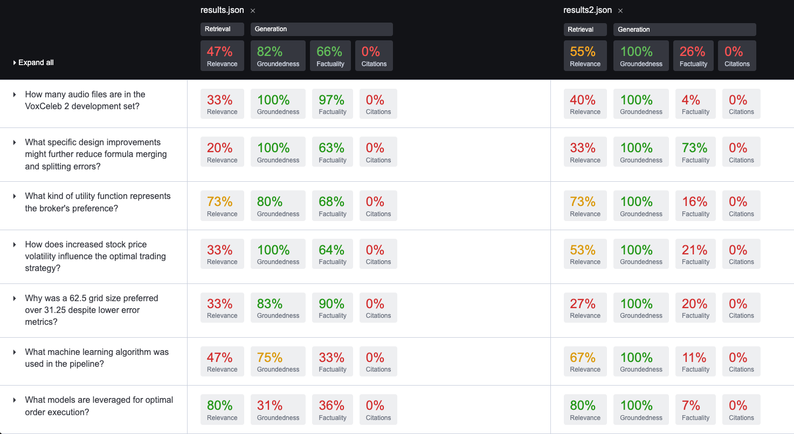

\newpage

## Abstract

Retrieval-Augmented Generation (RAG) erweitert grosse Sprachmodelle um externes Wissen, stösst jedoch in rein vektorbasierten Ausprägungen bei komplexen, mehrschrittigen Anfragen an konzeptionelle Grenzen. Insbesondere fehlt eine explizite Modellierung von Beziehungen zwischen Entitäten. Graphbasierte RAG-Ansätze adressieren dieses Defizit, indem Wissen strukturiert und traversierbar repräsentiert wird.

Diese Arbeit untersucht graphbasierte RAG-Architekturen anhand des Projekts IMARA. Auf Basis wissenschaftlicher PDFs wird eine End-to-End-Pipeline von der Dokumentenextraktion über die Graphkonstruktion bis zur Evaluation aufgebaut. Klassisches RAG wird mit mehreren GraphRAG-Varianten verglichen. Die Evaluation erfolgt reproduzierbar mit OpenRAGBench und OpenRAG-Eval.

\newpage

## 1. Einleitung

Das Projekt IMARA untersucht die Frage, inwiefern graphbasierte Retrieval-Ansätze die Qualität von RAG-Systemen bei komplexen, wissensintensiven Fragestellungen verbessern können. Der Fokus liegt auf wissenschaftlichen Dokumenten mit hoher struktureller und semantischer Komplexität.

Ziel ist der systematische Vergleich eines naiven, rein vektorbasierten RAG-Ansatzes mit verschiedenen GraphRAG-Varianten unter kontrollierten Bedingungen. Dazu wird eine reproduzierbare Pipeline aufgebaut, die von der PDF-Extraktion bis zur Evaluation reicht.

### 1.1 Problemstellung

Naive RAG-Architekturen basieren auf Ähnlichkeitssuche über Text-Chunks. Dieser Ansatz weist mehrere Schwächen auf:

- Wissen liegt fragmentiert vor und verliert kontextuelle Zusammenhänge.
- Beziehungen zwischen Entitäten sind implizit und nicht explizit modelliert.
- Multi-Hop-Reasoning über mehrere Dokumente oder Abschnitte ist nur eingeschränkt möglich.
- Die Qualität hängt stark von der Chunking-Strategie ab.

Gerade wissenschaftliche Publikationen mit Querverweisen, formalen Definitionen und Abhängigkeiten sind so nur unzureichend erschliessbar.

### 1.2 Projektziele

Aus dieser Problemstellung leiten sich die Ziele von IMARA ab:

1. Aufbau einer graphbasierten RAG Pipeline zur Erstellung dichter Wissensgraphen aus wissenschaftlichen PDFs.
1. Systematischer Vergleich klassischer vektorbasierter RAG-Ansätze mit verschiedenen GraphRAG-Varianten (u. a. LeanRAG, LinearRAG, GraphMERT).
1. Entwicklung einer flexiblen, wiederholbaren Pipeline vom PDF bis zur Evaluation, inklusive Datenversionierung (DVC), Orchestrierung und MLflow-gestützter Nachvollziehbarkeit.
1. Nutzung von OpenRAGBench/OpenRAG-Eval zur objektiven, reproduzierbaren Bewertung unterschiedlicher Varianten.

\newpage

## 2. Stand der Technik

Dieses Kapitel beschreibt relevante Arbeiten und Konzepte im Bereich RAG und GraphRAG.

### 2.1 LeanRAG

LeanRAG ist ein graphbasierter RAG-Ansatz, bei dem Entitäten zu semantisch kohärenten Clustern mit explizit modellierten Relationen zusammengefasst werden. Diese Cluster bilden aggregierte Knoten, die als hierarchische Navigationsschicht über dem feingranularen Detailgraphen fungieren. Anfragen werden zunächst auf Entitätsebene verankert und anschliessend über aggregierte Ebenen hinweg erweitert, um relevante Evidenz effizient zu sammeln. Durch diese hierarchische Struktur lässt sich die Redundanz im Retrieval deutlich reduzieren; die Autoren berichten in ihren Benchmarks von einer Reduktion um etwa 46 % gegenüber flachen Baseline-Ansätzen. Der Ansatz wurde von Zhang et al. (2025) vorgestellt und dient im Projekt IMARA als Referenz für einen explizit relationenbasierten GraphRAG-Ansatz mit semantischer Aggregation.

{width=100%}

### 2.2 LinearRAG

LinearRAG („Linear Graph Retrieval-Augmented Generation on Large-scale Corpora“) verfolgt einen abweichenden Ansatz, bei dem ein relation-freier Graph konstruiert wird, der vollständig ohne LLM-basierte Relationsextraktion auskommt. Entitäten sowie ihre Ko-Vorkommensstrukturen werden stattdessen algorithmisch bestimmt. Die Graphkonstruktion bleibt kontext­erhaltend, da leichtgewichtige Entity Recognition und semantische Verlinkung eingesetzt werden, um Zusammenhänge über Passagen- und Satzgrenzen hinweg zu bewahren. Multi-Hop-Reasoning wird über semantische Brücken im Graphen ermöglicht, ohne dass explizite Relationen modelliert werden müssen. Der Ansatz verursacht keine LLM-Tokenkosten und skaliert linear hinsichtlich Laufzeit und Speicherbedarf. LinearRAG wurde von Li et al. (2025) vorgestellt und bildet im Projekt IMARA den primären GraphRAG-Ansatz, der vollständig implementiert und empirisch evaluiert wurde.

{width=100%}

### 2.3 GraphMERT

GraphMERT adressiert die Skalierbarkeitsprobleme klassischer neurosymbolischer Frameworks und wurde von Belova et al. (2025) vorgeschlagen. Es handelt sich um ein kompaktes, graphbasiertes Encoder-Modell, das aus unstrukturierten Textkorpora hochwertige Wissensgraphen generiert. Dabei werden neuronale Netze zur Erlernung abstrakter Repräsentationen mit symbolischen Strukturen in Form eines Wissensgraphen kombiniert, um nachvollziehbares und verifizierbares Schliessen zu ermöglichen. Ziel ist eine effiziente und skalierbare neurosymbolische Architektur mit hoher faktischer Korrektheit, beispielsweise gemessen mittels FActScore, sowie konsistenten Relationen, bewertet über den ValidityScore.

{width=49%}
{width=49%}

Die Abfrage erfolgt direkt auf dem Wissensgraphen und nutzt dessen explizite Struktur. Anstatt isolierte Textsegmente über Vektorähnlichkeit zu vergleichen, traversiert der Suchprozess semantisch angereicherte, verkettete Knoten und unterstützt so linear skalierbares Multi-Hop-Reasoning.

{width=49%}
{width=49%}

In der vorgelagerten Extraktion wird unstrukturierter Text in Entitäten und Relationen überführt und anschliessend semantisch aggregiert. Dadurch werden redundante Strukturen reduziert, die Graphkomplexität verringert und die Effizienz des Retrievals erhöht. Im Projekt IMARA dient GraphMERT als Referenzkonzept, das anhand prototypischer Implementierungen und Visualisierungen qualitativ analysiert wurde.

### 2.4 OpenRAGBench und OpenRAG-Eval

OpenRAGBench stellt einen umfangreichen Datensatz aus wissenschaftlichen PDFs (arXiv) mit zugehörigen Frage-Antwort-Paaren bereit und bildet die Grundlage für reproduzierbare Benchmarks im Bereich Retrieval-Augmented Generation. OpenRAG-Eval ist ein darauf aufbauendes Evaluations-Framework, das unterschiedliche RAG-Systeme anhand einheitlicher Metriken wie Accuracy, Contain Accuracy und Faithfulness vergleichbar macht. Im Projekt IMARA wird OpenRAG-Eval eingesetzt, um naives RAG, LinearRAG und weitere GraphRAG-Varianten konsistent und reproduzierbar zu bewerten.

\newpage

## 3. Hintergrund / Background

In diesem Kapitel wird der fachliche Hintergrund vertieft, insbesondere die Grenzen vektorbasierter RAG-Systeme und das GraphRAG-Paradigma.

### 3.1 Grenzen vektorbasierten (naiven) RAGs

Klassische RAG-Systeme basieren auf einer Vektorsuche über in Chunks zerlegte Texte. Dokumente werden dabei in Segmente fester Länge aufgeteilt, eingebettet und in einer Vektordatenbank gespeichert. Benutzeranfragen werden ebenfalls eingebettet, woraufhin die semantisch ähnlichsten Chunks als Kontext für die Antwortgenerierung abgerufen werden.

Dieser Ansatz weist mehrere grundlegende Limitierungen auf:

#### 3.1.1 Kontextuelle Fragmentierung**

Durch das Chunking wird der natürliche Informationsfluss eines Dokuments künstlich unterbrochen. Relevanter Kontext kann über mehrere Chunks, Abschnitte oder Dokumente verteilt sein und wird von der Vektorsuche, die jeden Chunk isoliert betrachtet, häufig nur unvollständig erfasst. Zwar wird semantische Ähnlichkeit erkannt, explizite Beziehungen wie Kausalität, Abhängigkeiten oder hierarchische Strukturen bleiben jedoch unberücksichtigt.

#### 3.1.2 Abhängigkeit von der Chunking-Strategie

Die Leistungsfähigkeit naiver RAG-Systeme ist stark von der gewählten Chunking-Strategie abhängig. Zu grosse Chunks führen zu inhaltlichem Rauschen, während zu kleine Chunks wichtigen Kontext verlieren lassen. Eine optimale Konfiguration erfordert oft aufwändige, heuristische Feinabstimmungen und bleibt fragil gegenüber Änderungen im Dokumententyp oder Anwendungsfall.

#### 3.1.3 Eingeschränktes Multi-Hop-Reasoning

Naive RAG-Ansätze sind nur begrenzt in der Lage, Fragen zu beantworten, die mehrere logisch verknüpfte Informationsschritte erfordern. Solche Multi-Hop-Fragestellungen setzen voraus, dass Zusammenhänge über mehrere Textstellen hinweg erkannt und kombiniert werden. Eine rein vektorbasierte Suche ist hierfür in der Regel nicht ausreichend, da sie keine explizite Verknüpfung zwischen den relevanten Informationseinheiten herstellt.

### 3.2 Das AI-Native GraphRAG-Paradigma

AI-Native GraphRAG adressiert die Limitierungen vektorbasierten RAGs, indem Wissen explizit strukturiert wird. Unstrukturierte Daten werden entlang einer automatisierten Pipeline in natürlichsprachliche Antworten überführt, wobei die technische Komplexität von Graphen und Datenbanksystemen für Anwender abstrahiert bleibt. Im Unterschied zu klassischen Vektor-RAG-Ansätzen basiert das Retrieval nicht primär auf der semantischen Ähnlichkeit einzelner Text-Chunks, sondern auf einem expliziten Wissensmodell des Anwendungsbereichs.

Hierzu werden Entitäten (z. B. Methoden, Datensätze oder Metriken) sowie ihre Relationen als Knoten und Kanten in einem Wissensgraphen modelliert. Anfragen können anschliessend als Operationen auf diesem Graphen formuliert werden, etwa in Form von Pfadsuchen, Nachbarschaftsanalysen oder semantischer Aggregation. Dadurch wird Wissen nicht nur auffindbar, sondern explizit verknüpfbar und kontextuell interpretierbar.

Ein Wissensgraph transformiert eine passive Dokumentensammlung in ein aktives, abfragefähiges Wissensmodell und ermöglicht unter anderem:

- die explizite Modellierung von Entitätsbeziehungen,
- Multi-Hop-Reasoning über graphbasierte Pfade,
- die gemeinsame Nutzung strukturierter und unstrukturierter Informationsquellen.

Anschaulich formuliert stellt vektorbasiertes RAG isolierte Informationseinheiten bereit, vergleichbar mit einem Stapel einzelner Karteikarten. GraphRAG hingegen entspricht einer dynamischen Mindmap, in der Zusammenhänge sichtbar, nachvollziehbar und gezielt traversierbar sind.

\newpage

## 4. Methodik / Umsetzung

Dieses Kapitel beschreibt das konkrete Vorgehen im Projekt IMARA – von den Datenquellen über die PDF-Extraktion bis zur Implementierung des LinearRAG-Graphs und der Evaluationspipeline.

### 4.1 Hardware

Die Experimente wurden auf einem heterogenen Hardware-Setup durchgeführt, um unterschiedliche Verarbeitungsschritte unter realistischen Bedingungen evaluieren zu können. Zum Einsatz kamen unter anderem:

- Lenovo Tower i9-14900 mit 64 GB RAM und einer RTX 4090 (16 GB VRAM),
- ein Tower-System mit i9-14900, 256 GB RAM und drei RTX 6000 GPUs (je 48 GB VRAM),
- verschiedene Laptops (HP EliteBook X G11, Lenovo Legion 9) sowie ein MacBook M3 Pro.

Die Graphkonstruktion für LinearRAG konnte vollständig CPU-basiert durchgeführt werden, was die geringe Abhängigkeit dieses Ansatzes von spezialisierter Hardware unterstreicht. GPU-Ressourcen wurden primär für LLM-Inferenz sowie für die PDF-Extraktion mit Docling eingesetzt, sofern GPU-unterstützte Funktionen aktiviert waren. Dieses Setup erlaubte es, den Ressourcenbedarf der einzelnen Pipeline-Schritte differenziert zu analysieren und die Skalierbarkeit der Ansätze unter variierenden Hardwarebedingungen zu bewerten.

### 4.2 Datenbasis

Für die Experimente wurde eine Kombination aus generischen und domänenspezifischen Datensätzen verwendet. Als zentraler Korpus dient OpenRAGBench, ein arXiv-basierter Datensatz mit rund 1 000 wissenschaftlichen Publikationen und zugehörigen Frage-Antwort-Paaren. Ergänzend wurden 2WikiMultihop als Benchmark für Multi-Hop Question Answering sowie HotpotQA und Musique als weitere Multi-Hop-QA-Datensätze eingesetzt. Für die domänenspezifische Evaluierung kamen zusätzlich medizinische Datensätze, insbesondere Medical- und PubMedQA, zum Einsatz. Sämtliche Rohdaten werden mittels DVC versioniert, in einem S3-kompatiblen Supabase Storage abgelegt und können reproduzierbar über `dvc pull` bezogen werden.

### 4.3 Systemarchitektur

Die IMARA-Architektur ist als modulare End-to-End-Pipeline umgesetzt. Die zentralen Komponenten sind im Repository klar getrennt strukturiert: die Implementierung in `src/`, Konfigurationen in `configs/` sowie Datenartefakte in `data/`. Die Architektur folgt einer domänenspezifischen, graphbasierten RAG-Vision, die im Projektverlauf iterativ entwickelt und im internen Projektdokument [specs_v6.md](../../1.%20Projektantrag/specs_v6.md) konzeptuell festgehalten wurde.

{width=100%}

Ausgangspunkt der Pipeline ist die Data Ingestion. Wissenschaftliche PDFs aus OpenRAGBench werden mithilfe von Docling in maschinenlesbare Artefakte überführt, typischerweise in Form von Markdown-, JSON- und Doctags-Ausgaben. Für jedes Quelldokument wird ein eigener Verzeichnisbaum mit sämtlichen Zwischenständen erzeugt, wodurch der Verarbeitungsworkflow – etwa alternative Chunking- oder Embedding-Strategien – flexibel angepasst und reproduzierbar variiert werden kann.

Im Anschluss erfolgt das Chunking und Embedding der extrahierten Texte. Die Dokumente werden mit konfigurierbaren Strategien in Textsegmente zerlegt und unter Verwendung unterschiedlicher Embedding-Modelle vektorisiert. Die resultierenden Embeddings werden gemeinsam mit Metadaten in einer PostgreSQL-Datenbank mit pgvector-Erweiterung persistiert und bilden die Grundlage für nachgelagerte Retrieval- und Graphschritte.

Darauf aufbauend stellt ein naiver RAG-Baustein eine Baseline bereit, die mittels Ähnlichkeitssuche über die eingebetteten Chunks relevante Kontexte identifiziert und diese an ein LLM zur Antwortgenerierung übergibt. Parallel dazu werden graphbasierte RAG-Varianten wie LinearRAG, LeanRAG und GraphMERT eingesetzt. In diesen Ansätzen werden aus den extrahierten Texten explizite Wissensgraphen konstruiert, um Retrieval und Antwortgenerierung durch strukturierte Repräsentationen und Multi-Hop-Reasoning zu unterstütze

Die Ausführung der einzelnen Verarbeitungsschritte wird durch eine Orchestrierungsschicht koordiniert, welche Jobs, Workflows und Statusinformationen verwaltet. Sowohl einzelne Pipeline-Komponenten als auch vollständige End-to-End-Läufe können über Kommandozeilenwerkzeuge und Skripte gesteuert werden. Für Benchmarking und Evaluation werden OpenRAGBench-Experimente mit OpenRAG-Eval orchestriert; dabei werden Metriken wie Genauigkeit, Evidenzabdeckung und Laufzeit erhoben und in MLflow protokolliert, um Experimente nachvollziehbar und vergleichbar zu machen.

### 4.4 PDF-Extraktion (Docling)

Für die Konvertierung der PDFs in maschinenlesbare Formate (Markdown, JSON, Doctags) wird das Docling Toolkit eingesetzt. Die Extraktion ist der erste kritische Schritt der Pipeline, da hier die spätere Qualitätsobergrenze des gesamten Systems definiert wird.

{width=100%}

#### 4.4.1 Konfiguration und Parameter

Die Docling-Integration folgt dem in der Projektbeschreibung definierten Parameter-Set. Wichtige Aspekte:

- Unterstützung mehrerer Inputformate (`pdf`, `docx`, `pptx`, `html`, `image`, `xlsx`, `md`, `asciidoc`).
- Generierung verschiedener Output-Artefakte: `md`, `json`, `html`, `text`, `doctags`.
- Aktivierte Zusatzfunktionen:
  - OCR (`do_ocr=True`) inkl. `easyocr`-Backend.
  - Extraktion von Tabellenstrukturen (`do_table_structure=True`).
  - Code- und Formel-Anreicherung (`do_code_enrichment=True`, `do_formula_enrichment=True`).
  - Bildklassifikation und Bildbeschreibung via lokalem Vision-Language-Modell.

Alle relevanten Parameter sind in der Projektkonfiguration (`configs/`) zentralisiert und können für zukünftige Experimente angepasst werden.

!TODO: @Marco: wo genau liegen diese? im configs ist nichts.

#### 4.4.2 Technische Umsetzung und Designentscheidungen

Während der Implementierung der PDF-Extraktion wurden mehrere technische Anpassungen vorgenommen, um Stabilität und Reproduzierbarkeit der Pipeline sicherzustellen. Aufgrund von Speicher- und Stabilitätsproblemen wurde auf den containerisierten Betrieb von Docling (`docling-serve`) verzichtet und stattdessen die direkte Integration über die Python-API gewählt. Die Extraktion wurde überwiegend CPU-basiert durchgeführt, da GPU-Ressourcen in dieser Phase keinen stabilen Betrieb aller benötigten Funktionen ermöglichten.

Zusätzlich wurde für rechenintensive Extraktionsläufe ein dedizierter Rechner eingesetzt, um lange Laufzeiten einzelner Dokumente von der übrigen Entwicklungsumgebung zu entkoppeln. Diese Massnahmen erlaubten einen kontrollierten und reproduzierbaren Ablauf der Extraktion und bildeten die Grundlage für die nachfolgenden Pipeline-Schritte.

### 4.5 Naives RAG (Baseline)

Das naive RAG dient im Projekt IMARA als Referenzbaseline, anhand derer die graphbasierten Ansätze (LinearRAG, LeanRAG, GraphMERT) eingeordnet werden. Die Implementierung folgt bewusst einem klassischen, vektorbasierten RAG-Paradigma: Dokumente werden in Text-Chunks zerlegt, gespeichert, eingebettet und ausschliesslich über Vektorsuche wieder abgerufen.

#### 4.5.1 Chunking und Datenpersistierung

In der ersten Phase (`naiverag/chunk.py`) werden die von Docling erzeugten JSON-Dokumente (`DoclingDocument`) mit dem `HierarchicalChunker` aus `docling_core` in semantisch sinnvolle Textsegmente zerlegt. Die Chunking-Parameter – insbesondere Chunk-Grösse, Überlappung und Split-Kriterium – werden zur Laufzeit aus der zentralen Konfiguration (`params.yaml`, Sektion `chunk`) geladen und als MLflow-Parameter protokolliert. Falls zu einem Dokument ein Artefaktverzeichnis mit exportierten Bildern (`<titel>_artifacts/image_*.png`) existiert, werden die relativen Bildpfade ermittelt und zusammen mit dem Chunktest abgelegt: Chunks, die Bildinhalte referenzieren, enthalten am Ende einen `[IMAGES]`‑Block mit den zugehörigen Bildpfaden. Die resultierenden Chunks werden als einfache `.txt`‑Dateien im angegebenen Ausgabeverzeichnis gespeichert und bilden die Grundlage für die weitere Verarbeitung.

#### 4.5.2 Embedding, Retrieval und Baseline-Charakter

In der zweiten Phase (`naiverag/embed.py`) werden diese Text-Chunks zusammen mit ihren Metadaten in die relationale Datenbank überführt. Das Skript liest alle `.txt`‑Dateien aus dem Chunk-Verzeichnis, leitet aus dem Dateinamen den Dokumenttitel und eine Seitenreferenz (`page_ref`) ab und rekonstruiert die Verweise auf Bildartefakte, indem es nach einem passenden `<titel>_artifacts`‑Verzeichnis sucht. Die gefundenen Bildpfade werden als JSON‑kodierte Liste im Feld `pic_ref` abgelegt. Für jeden Chunk werden MLflow-Metriken wie `content_size_bytes`, ein Flag für vorhandene Seitenreferenzen und ein Flag für Bildreferenzen geloggt. Anschliessend werden Titel, Seitenreferenz, Bildreferenzen und der eigentliche Chunktest in die Tabelle `document_chunk` einer PostgreSQL-Datenbank geschrieben. Diese Tabelle dient als zentrale, normalisierte Textbasis für das naive RAG ebenso wie für die graphbasierten Pipelines.

Aufbauend auf dieser Speicherung wird das eigentliche RAG-Verhalten durch einen separaten Embedding‑ und Retrieval‑Schritt realisiert: Die Inhalte aus `document_chunk` werden mit einem ausgewählten Embedding‑Modell in Vektoren überführt und in pgvector‑Feldern persistiert. Anfragen werden eingebettet, per Vektorsuche (k‑nächste Nachbarn) gegen diese Chunks gematcht und die Top‑k‑Kontexte an ein LLM zur Antwortgenerierung übergeben. Der naive RAG‑Pfad verzichtet dabei vollständig auf Graphkonstruktion und setzt ausschliesslich auf Vektorsimilaritätssuche über Text-Chunks, womit er als klare, interpretierbare Baseline für die Bewertung der Mehrwerte der GraphRAG‑Ansätze dient.

### 4.6 LinearRAG

Die Implementierung von Linear RAG im IMARA-Projekt zielt darauf ab, die theoretischen Vorteile – lineare Komplexität und Kontextbewusstsein – in eine performante Pipeline zu überführen. Im Gegensatz zu komplexen GraphRAG-Ansätzen verzichtet diese Implementierung auf LLM-basierte Extraktion von Relationen und setzt stattdessen auf deterministische NLP-Prozesse und algorithmische Graphentraversierung.

#### 4.6.1 Datenaufbereitung & Loading

Der Loading-Prozess dient als Schnittstelle zwischen den extrahierten Rohdaten und der LinearRAG-Pipeline. Die Text-Chunks werden aus der PostgreSQL-Tabelle `document_chunk` geladen, welche als konsolidierte Datenbasis für alle nachfolgenden Verarbeitungsschritte fungiert.

Ein zentrales Element dieses Schrittes ist die Sicherstellung von Idempotenz. Für jeden Chunk wird ein deterministischer MD5-Hash auf Basis seines Inhalts erzeugt. Dieser Hash verhindert die Entstehung von Duplikaten bei wiederholten Pipeline-Läufen und ermöglicht eine inkrementelle Aktualisierung des Datenbestands, ohne eine vollständige Neuindizierung durchführen zu müssen. Die persistierten Chunks bilden damit eine stabile „Ground Truth“ für die Graphkonstruktion.

#### 4.6.2 Graph-Konstruktion

Die Graphkonstruktion erfolgt on-the-fly aus den flachen Textdaten, ohne den Einsatz von LLMs. Als NLP-Engine wird scispaCy mit dem Modell `en_core_sci_md` verwendet, das sich für die Extraktion technischer Entitäten aus wissenschaftlichen Publikationen als geeignet erwiesen hat.

Der resultierende Wissensgraph besteht aus drei Knotentypen:

- **Passage Nodes**, die vollständige Text-Chunks repräsentieren,
- **Sentence Nodes**, welche die Chunks in feinere Untereinheiten zerlegen,
- **Entity Nodes**, die benannte Entitäten wie Methoden, Metriken oder wissenschaftliche Konzepte abbilden.

Die Kanten zwischen diesen Knoten werden nicht semantisch inferiert, sondern deterministisch berechnet. Hierzu kommen mehrere Kantentypen zum Einsatz: strukturelle Containment-Beziehungen zwischen Passages, Sentences und Entities, sequentielle Nachbarschaftsbeziehungen zwischen Passages sowie gewichtete Passage–Entity-Kanten. Die Gewichtung dieser Kanten erfolgt mittels TF-IDF, um die Relevanz einer Entität innerhalb eines Textabschnitts quantitativ abzubilden.

#### 4.6.3 Hybrid Retrieval-Algorithmus

Die Retrieval-Logik kombiniert klassische Vektorsuche mit graphbasierter Relevanzpropagation. Zunächst werden aus der Benutzeranfrage mittels spaCy potenzielle Seed-Entitäten extrahiert, die als Einstiegspunkte in den Graphen dienen. Parallel dazu werden über Vektorsuche semantisch ähnliche Textpassagen identifiziert.

Auf Basis dieser Kandidaten wird ein graphbasierter Scoring-Schritt durchgeführt, der auf einem Personalized-PageRank-Verfahren basiert. Dabei wird Relevanz entlang der Graphstruktur propagiert, sodass auch Knoten berücksichtigt werden, die nicht direkt über Vektorähnlichkeit, aber über strukturelle Beziehungen mit relevanten Entitäten verbunden sind. Dieser mehrstufige Ansatz ermöglicht die Berücksichtigung verteilter Kontexte und unterstützt Multi-Hop-Reasoning über mehrere Graphpfade hinweg.

#### 4.6.4 Physisches Datenmodell

Die Persistenzschicht von LinearRAG basiert auf PostgreSQL unter Verwendung der `pgvector`-Extension. Die Graphstruktur wird relational in den Tabellen `lr_graph_node` und `lr_graph_edge` abgelegt, wodurch SQL-basierte Traversierungen, etwa mittels rekursiver CTEs, möglich sind.

Zusätzlich werden Vektorrepräsentationen von Entitäten in der Tabelle `lr_entity_embedding` gespeichert. Hierbei kommen unterschiedliche Embedding-Modelle mit variierenden Vektordimensionen zum Einsatz, um sowohl semantische Tiefe als auch Latenzanforderungen abzudecken. Diese Kombination ermöglicht hybride Abfragen, bei denen graphbasierte Strukturen und Vektorsuche effizient zusammenwirken.

### 4.7 GraphMERT

!TODO: @Marco

### 4.8 Evaluierungs-Design

Für die Evaluierung der Systeme wurde folgendes Vorgehen gewählt:

OpenRAGBench dient als Hauptkorpus sowohl für die Graphkonstruktion als auch für das Query-Set, während OpenRAG-Eval die Ausführung der QA-Läufe sowie deren Auswertung orchestriert. In den Konfigurationsdateien `configs/open_rag_eval_*.yaml` sind verschiedene Szenarien definiert, unter anderem für naives RAG, LinearRAG und weitere Varianten wie beispielsweise GraphMERT. Als zentrale Metriken werden LLM Accuracy (bewertet durch einen LLM-Judge), Contain Accuracy (Überprüfung, ob die Antwort im kontextuellen Evidenz-Set enthalten ist) sowie Laufzeit- und Ressourcenaspekte herangezogen. In einem nächsten Schritt ist geplant, die Evaluierungen direkt mit DVC-Pipelines und MLflow-Runs zu verknüpfen, um Vollständigkeit und Nachvollziehbarkeit weiter zu erhöhen.

\newpage

## 5. Resultate

Vergleich der Performance: Standard RAG vs. IMARA GraphRAG vs. Fine-tuned Model.

### 5.1 PDF-Extraktion mit Docling

Die initiale Konfiguration der Docling-Extraktion führte zu unvollständigen Tabellen und fehlerhaften strukturellen Ausgaben, insbesondere bei komplex formatierten wissenschaftlichen PDFs. Durch den Vergleich und die iterative Anpassung unterschiedlicher Parameter-Sets konnte die Extraktionsqualität deutlich verbessert werden. Die optimierte Konfiguration resultierte in vollständigeren Tabellenstrukturen und konsistenteren Textrepräsentationen.

{width=100%}

Die Abweichungen umfassten teilweise ganze Tabellen, die in der ursprünglichen Konfiguration fehlten oder unvollständig waren.

{width=100%}

Die Analyse der Pipeline zeigte dabei klar unterscheidbare Sätze „problematischer“ versus „erfolgreicher“ Parameter.

{width=100%}

{width=100%}

Gleichzeitig zeigte sich ein erheblicher Ressourcenbedarf: Einzelne Dokumente benötigten mehrere Stunden für die vollständige Extraktion, insbesondere beim Parsing von Formeln. Zudem reichten 16 GB GPU-VRAM nicht aus, um alle Extraktionsfeatures stabil zu betreiben. In der Entwicklungsumgebung verursachten zusätzliche Hintergrundprozesse zeitweise hohen RAM-Verbrauch, was zu blockierten oder abgebrochenen Extraktionsläufen führte.

Darüber hinaus zeigte sich, dass das Parsen mathematischer Formeln sowohl auf CPU- als auch auf GPU-basierten Ausführungen mit sehr hohen Laufzeiten verbunden war. Einzelne Dokumente benötigten mehrere Stunden für die vollständige Extraktion, was den Durchsatz der Massenverarbeitung erheblich reduzierte.

### 5.2 Naives RAG

Für die Baseline wurden die mit Docling extrahierten Dokumente in kurze Text-Chunks zerlegt und in der Tabelle `document_chunk` persistiert. Typische Chunks umfassen ein bis wenige Sätze, z. B. eine einzelne Empfehlung aus einem Paper („Recommendation 2.4: Ethics is a topic that, given the nature of data science, students should learn and practice throughout their education.“), Schlagwortzeilen wie „Index Terms – self-supervised learning, self-labeling, knowledge distillation, noisy label modeling, speaker recognition“ oder isolierte Formeln („$$R + \\frac{\\mu}{\\theta \\sigma^2} < A - \\frac{1}{\\cosh \\kappa T - 1} \\cdot (x_0 - A).$$“). In Fällen, in denen Docling Bilder extrahiert hat, enthalten die Chunks zusätzlich einen `[IMAGES]`‑Block mit relativen Bildpfaden.

Diese feingranulare Segmentierung erlaubt eine präzise Vektorsuche, führt aber auch zu Kontextfragmentierung: Viele Fragen erfordern Informationen, die über mehrere solcher Kurz-Chunks verteilt sind. In den OpenRAG-Eval-Läufen zeigte sich deshalb, dass das naive RAG bei lokal verankerten Faktenfragen brauchbare Antworten liefert, bei Multi-Hop-Fragen jedoch häufiger entweder unvollständigen Kontext zurückliefert oder relevante Teile über mehrere Chunks verstreut bleiben. Damit bestätigt die Baseline die theoretisch erwarteten Grenzen rein vektorbasierter RAG-Systeme und dient als Referenzpunkt für die graphbasierten Ansätze.

### 5.3 LinearRAG

#### 5.3.1 Ausgangslage

Die Ausgangslage bilden die 1001 wissenschaftlichen Publikationen aus dem in Abschnitt 4.2 beschriebenen Datensatz. Alle nachfolgenden Vergleiche beziehen sich auf das ursprüngliche LinearRAG-Paper [4].

Im Folgenden wird der konstruierte Graph charakterisiert und gegen die im Referenzpaper definierten Qualitätsmetriken verglichen.

#### 5.3.2 Graphstruktur und Umfang

Der für LinearRAG konstruierte Wissensgraph basiert auf dem OpenRAGBench-Korpus und umfasst insgesamt rund 1.75 Millionen Knoten und etwa 7.0 Millionen Kanten. Die Knoten verteilen sich auf Passage-, Sentence- und Entity-Nodes. Die resultierende Graphstruktur weist eine sehr geringe Dichte auf, was auf eine hohe Sparsität des Wissens bei gleichzeitig begrenzter Evidenzabdeckung im Retrieval hinweist.

| Metrik | Wert |
|-------|------:|
| Total Passages | 278,692 |
| Total Sentences | 908,997 |
| Total Unique Entities | 596,824 |
| Total Graph Nodes | 1,751,262 |
| Total Graph Edges | 7,015,416 |

#### 5.3.3 TF-IDF-Gewichtung

Die Auswertung bescheinigt der Verteilung eine exzellente Qualität mit starker Trennschärfe und symmetrischer Struktur, wodurch Entitäten effektiv nach ihrer Wichtigkeit unterschieden werden. Der breite Dynamikbereich ohne Nullwerte deckt dabei sowohl allgemeine als auch hochspezialisierte Konzepte zuverlässig ab und gilt als optimal für den Einsatz in LinearRAG. der TF-IDF-Gewichte der Passage–Entity-Kanten zeigt eine symmetrische Verteilung mit ähnlichen Werten für Mittelwert und Median. Die Gewichte decken einen breiten Wertebereich ab und erlauben eine differenzierte Quantifizierung der semantischen Relevanz von Entitäten innerhalb einzelner Passagen.

| Kennzahl | Wert |
|--------|-----:|
| Mittelwert (Mean) | 6.65 |
| Median | 6.43 |
| Minimum | 2.31 |
| Maximum | 92.16 |
| Standardabweichung | 3.14 |

{width=100%}

#### 5.3.4 Graph-Sparsität

Die Untersuchung der Graphstruktur zeigt eine extrem hohe Sparsität. Von mehreren Billionen theoretisch möglichen Kanten sind nur wenige Millionen tatsächlich realisiert. Dies resultiert in einer sehr geringen Graphdichte und bestätigt die inhärente Sparsität des relation-freien Ansatzes. Die gemessene Gesamtsparsität von 99.9995% übertrifft die Anforderungen des Referenzpapers deutlich und belegt eine Hyper-Effizienz, die weit über dem geforderten Minimum liegt. Diese Werte validieren den relation-freien Ansatz, da trotz TF-IDF-Gewichtung nur semantisch relevante Verbindungen bestehen bleiben und somit die lineare Skalierbarkeit des Systems bewiesen wird.

| Kennzahl | Wert |
|--------|-----:|
| Theoretisch mögliche Kanten | 1,533,458,420,691 |
| Tatsächliche Kanten | 7,015,416 |
| Graphdichte | 0.000457 % |
| Graph-Sparsität | 99.9995 % |

#### 5.3.5 Zusammenfassung zentraler Graphmetriken

Die aggregierten Graphmetriken verdeutlichen den Umfang und die strukturellen Eigenschaften des LinearRAG-Graphen. Neben der hohen Sparsität zeigen sich stabile Durchschnittswerte hinsichtlich der Anzahl von Entitäten pro Passage sowie der Wiederverwendung von Entitäten über mehrere Textabschnitte hinweg

| Metrik | Wert |
|-------|-----:|
| Entities pro Passage (unique) | 2.14 |
| Sentences pro Passage | 3.26 |
| Passages pro Entity (avg) | 4.34 |
| Passages ohne Entities | 37,117 (13.32 %) |

### 5.4 GraphMERT

!TODO: @Marco

### 5.5 LeanRAG

Für LeanRAG wurde insbesondere der Ressourcenbedarf nach einem Refactoring des Schritts der Triple-Extraktion analysiert. Die entsprechende Auswertung zeigt den Verbrauch an CPU-, Speicher- und GPU-Ressourcen während dieses kritischen Verarbeitungsschritts.

{width=49%}

### 5.5 Benchmark

\newpage

## 6. Diskussion

### 6.1 Docling

Ein Verzicht auf die Extraktion mathematischer Formeln kam im Projekt nicht in Betracht, da diese einen wesentlichen Bestandteil wissenschaftlicher Publikationen darstellen. Die Ergebnisse zeigen jedoch, dass Formel-Parsing einen dominanten Kostenfaktor in der Extraktionspipeline darstellt und bei der Skalierung graphbasierter RAG-Systeme explizit berücksichtigt werden muss.

### 6.2 naives RAG

Die Ergebnisse des naiven RAG bestätigen die in Kapitel 3.1 beschriebenen Limitierungen vektorbasierter Ansätze. Die sehr kurz gehaltenen Chunks – von einzelnen Empfehlungen über Schlagwortlisten bis hin zu isolierten Formeln – funktionieren gut für einfache, lokal verankerte Faktenfragen, liefern aber bei komplexeren Multi-Hop-Fragen häufig nur Teilkontext. In den OpenRAG-Eval-Läufen zeigte sich, dass das LLM in solchen Fällen zwar gelegentlich korrekte Antworten generiert, diese jedoch nicht immer sauber auf im Kontext vorhandene Evidenz zurückgeführt werden können, was sich in einer im Vergleich zu LinearRAG niedrigeren Contain Accuracy widerspiegelt. Gleichzeitig ist die naive Pipeline klar einfacher und ressourcenschonender: Es entfallen Graphkonstruktion und graphbasierte Traversierungen, Online-Kosten beschränken sich auf Vektorsuche und Generierung. Insgesamt eignet sich das naive RAG damit gut als schnelle, interpretierbare Baseline, ist aber für die im Projekt betrachteten, wissensintensiven Multi-Hop-Szenarien nur bedingt ausreichend und macht den Mehrwert expliziter Graphstrukturen deutlich sichtbar.

### 6.3 LinearRAG

#### 6.3.1 Validierung des LinearRAG-Ansatzes

Die gemessenen Graphmetriken bestätigen die grundlegenden Annahmen des LinearRAG-Ansatzes. Insbesondere die hohe Sparsität des Graphen entspricht den theoretischen Erwartungen eines deterministischen, relation-freien Modells und steht im Einklang mit den im ursprünglichen LinearRAG-Paper formulierten Zielen.

| Claim | IMARA LinearRAG | Referenz (Paper) | Bewertung |
|------|----------------|------------------|-----------|
| Entities pro Passage | ~9.3 (inkl. Duplikate) | ~10 | Bestätigt |
| Entities pro Sentence | ~3.5 | ~4 | Bestätigt |
| Graph-Sparsität | 99.9995 % | >99 % | Übertrifft |
| LLM-freie Konstruktion | Ja (scispaCy) | Ja | Bestätigt |
| Tri-Graph-Struktur | Passage / Sentence / Entity | Gleich | Implementiert |

#### 6.3.2 Skalierbarkeitsimplikationen

Die beobachtete Sparsität impliziert eine nahezu lineare Skalierung von Speicherbedarf und Rechenaufwand in Abhängigkeit von der Korpusgröße. Im Vergleich zu dichteren, LLM-basierten GraphRAG-Ansätzen bleibt der Ressourcenbedarf von LinearRAG auch bei wachsenden Datenmengen beherrschbar, was den Ansatz für produktive Szenarien mit großen Dokumentkorpora besonders relevant macht.

#### 6.3.3 Einordnung im Kontext graphbasierter RAG-Systeme

Durch den Verzicht auf LLM-basierte Relationsextraktion erreicht LinearRAG eine hohe Reproduzierbarkeit und vollständige Unabhängigkeit von Tokenkosten. Diese Eigenschaften positionieren den Ansatz als skalierbare Alternative innerhalb des Spektrums graphbasierter RAG-Systeme, insbesondere in Szenarien, in denen deterministisches Verhalten und Kostenkontrolle im Vordergrund stehen.

### 6.3.4 OpenRAG Eval Benchmark vs. Naive RAG

Dieser Abschnitt vergleicht die Ergebnisse der IMARA-Implementierung von LinearRAG mit dem Naive RAG im Rahmen der OpenRAG Eval.

Hinweis: Aus Ressourcengründen wurde der Graph mit vollständigen Embeddings exemplarisch für 5 Publikationen und 10 Queries berechnet. Die Ergebnisse lassen dennoch bereits deutliche Tendenzen erkennen.

{width=49%}

### 6.4 GraphMERT

!TODO: @Marco

### 6.5 LeanRAG

!TODO: @Marco

### 6.6 Benchmark

!TODO:

\newpage

## 7. Conclusion / Fazit

Das Projekt IMARA hatte das Ziel, eine domänenspezifische GraphRAG-Pipeline mit Modell-Fine-tuning vorzubereiten und die Effektivität graphbasierter RAG-Ansätze im Vergleich zu naivem RAG zu evaluieren.

**Zentrale Ergebnisse:**

- Es wurde eine skalierbare LinearRAG-Implementierung realisiert, die auf einem grossen wissenschaftlichen Korpus (OpenRAGBench) einen dichten Wissensgraphen mit über 1.7 Mio. Knoten und 7.3 Mio. Kanten aufbaut.
- Die Evaluierung zeigt, dass LinearRAG auf Multi-Hop-Benchmarks konkurrenzfähige bis sehr gute Genauigkeiten erzielt und klassische Limitierungen vektorbasierter RAG-Systeme adressiert.
- Die Arbeit bestätigt, dass Datenqualität (insbesondere PDF-Extraktion) und Graphdesign entscheidende Hebel für die Gesamtleistung sind.
- Durch DVC, MLflow und eine modulare Architektur ist die Grundlage für reproduzierbare Experimente und zukünftiges Fine-tuning gelegt.

Insgesamt konnte das Kernziel erreicht werden: Der Nutzen graphbasierter RAG-Ansätze gegenüber naiven Vektor-RAGs wurde qualitativ und quantitativ demonstriert. Gleichzeitig wurden offene Fragen und Herausforderungen klar sichtbar gemacht.

### 7.1 Persönliches Fazit

#### 7.1.1 Marco Allenspach

!TODO: @Marco Allenspach

#### 7.1.2 Lukas Koller

Für mich war eines der stärksten Learnings in diesem Projekt, wie schnell die Komplexität explodiert, sobald mehrere Komponenten – insbesondere LLMs – im Spiel sind. Schon kleine Designentscheidungen (z. B. welche Tools, welcher Datenpfad, welche Konfigurationsquelle) multiplizieren sich sehr schnell mit der Anzahl Daten, Pipelines und Modelle. In Kombination mit grossen Datenmengen führt das leicht dazu, dass man mehr Zeit mit Debugging, Infrastruktur und „Glue Code“ verbringt als mit der eigentlichen inhaltlichen Fragestellung.

Mein Fazit ist deshalb: lieber mit wenig Daten und klar begrenztem Scope einen stabilen End-to-End-Prozess etablieren, diesen messen und verstehen – und erst danach schrittweise mehr Daten, mehr Komplexität und weitere Modelle hinzufügen. In einer LLM-getriebenen Umgebung ist dieser iterative Ansatz aus meiner Sicht die einzige realistische Chance, die technische und kognitive Komplexität im Griff zu behalten.

#### 7.1.3 Emanuel Sovrano

Die strategische Entscheidung, für Training und Evaluation auf existierende Datensätze zurückzugreifen, erwies sich als essentiell. Ohne die Grundlage von OpenRAG Bench und OpenRAG Eval wäre eine valide Auswertung kaum möglich gewesen.

Technisch zeigte sich ein deutlicher Gegensatz: Während die einmalige Generierung des Graphen verhältnismässig geradlinig verlief, stellt die Entwicklung hin zu einem voll produktiven und wartbaren System eine erhebliche Hürde dar. Insbesondere die Anforderung, einzelne Dokumente dynamisch hinzuzufügen oder zu entfernen, würde schätzungsweise ein weiteres Personenjahr an Entwicklungszeit beanspruchen.

Auch infrastrukturell wurden Grenzen sichtbar. Trotz des grossen Aufwands, der in die lokale AI-Infrastruktur floss, blieb die Skalierbarkeit eine Herausforderung. Der Verzicht auf externe „AI Studios“ und Cloud-Anbieter machte die Generierung der Embeddings für den gesamten Korpus (1001 Dokumente) zu einem zeitkritischen Faktor, für dessen vollständige Optimierung letztlich die Ressourcen fehlten.

\newpage

## 8. Risikomanagement und Lessons Learned

### 8.1 Identifizierte Risiken

Im Projektverlauf wurden mehrere zentrale Risiken sichtbar. Die Datenqualität und die resultierende Graphdichte sind kritisch: Fehler in der PDF-Extraktion oder Entitätserkennung schlagen direkt auf die Qualität des Wissensgraphen und damit auf die Antwortqualität durch. Zudem ist die gesamte Pipeline – von der Docling-Extraktion über die Graphkonstruktion bis hin zu den LLM-Evaluierungen – deutlich rechenintensiv und stellt hohe Anforderungen an Hardware und Laufzeiten. Hinzu kommen Tooling- und Plattformabhängigkeiten: Unterschiedliche Betriebssysteme (Windows, Linux, macOS) sowie Werkzeuge wie VSCode, Supabase, Docling und die zugrunde liegenden Datenbanken und LLM-Backends bringen jeweils ihre eigenen Stolpersteine mit. Schliesslich erhöht die Vielzahl von Komponenten (DVC, MLflow, Supabase, PostgreSQL mit pgvector, LLM-Backends usw.) die Komplexität der Gesamtinfrastruktur und damit den Integrationsaufwand.

### 8.2 Konkrete Erfahrungen

Die Entscheidung, plattformunabhängig zu bleiben, erwies sich im Alltag als zusätzliche Herausforderung. Insbesondere unter Windows traten Inkompatibilitäten (beispielsweise mit MLflow) und erzwungene Reboots auf, die lang laufende Prozesse – etwa Docling-Batches – wiederholt unterbrachen. Unerwartete Hintergrundprozesse wie `cloudcode_cli.exe` konnten unbemerkt erhebliche Ressourcen blockieren und ML-Workloads so weit beeinträchtigen, dass Konvertierungen nicht mehr starteten oder einfrohren. Diese Erfahrungen haben gezeigt, dass eine klare Trennung von produktionsnahen Experimenten und „normalen“ Entwicklungsumgebungen sinnvoll ist; dedizierte Maschinen für rechenintensive Aufgaben wie die Docling-Extraktion vereinfachen Stabilität und Fehlersuche deutlich.

### 8.3 Lessons Learned

Aus diesen Erfahrungen lassen sich mehrere Lehren ableiten. Es ist hilfreich, möglichst früh im Projekt einen Ende-zu-Ende-Slice zu realisieren – etwa vom PDF bis zur einfachen Antwort –, um Risiken in Tooling, Infrastruktur und Datenflüssen sichtbar zu machen, bevor die Architektur zu komplex wird. Daten- und Modellversionierung sollten von Anfang an konsequent mit Werkzeugen wie DVC und MLflow umgesetzt werden, um Experimente nachvollziehbar, reproduzierbar und vergleichbar zu machen. Schliesslich hat sich gezeigt, dass eine schrittweise Komplexitätssteigerung sinnvoll ist: Zuerst eine stabile, naive RAG-Baseline etablieren, diese messen und verstehen, und darauf aufbauend GraphRAG-Komponenten sowie Fine-tuning iterativ ergänzen, statt alles gleichzeitig zu implementieren.

\newpage

## 9. Ausblick

Aus den bisherigen Ergebnissen und Erfahrungen ergeben sich mehrere konkrete Ansatzpunkte für zukünftige Arbeiten. Zunächst bleibt die zentrale Frage, ob ein kompaktes, domänenspezifisches Modell mit rund 80 M Parametern tatsächlich grössere, generische Modelle übertreffen kann. Die bisherigen Experimente deuten darauf hin, dass dies in klar abgegrenzten Domänen und bei gut kuratierten Trainingsdaten möglich ist, allerdings ist dafür eine sehr hohe Qualität der zugrunde liegenden Wissensrepräsentation erforderlich. Ein zentrales Lernfeld ist deshalb die Gestaltung und Pflege des Wissensgraphen selbst.

Die Qualität eines Wissensgraphen wird wesentlich durch die Qualität der Entitäten bestimmt. Sprachliche Mehrdeutigkeiten – etwa Berufsbezeichnungen versus Eigennamen – sollten systematisch durch kontextbasierte Attribute aufgelöst werden. Das Beispiel „Der Müller hat den Beruf eines Maurers“ illustriert dies: Die Entity „Müller“ ist hier kein Beruf, sondern eine Person mit dem Familiennamen Müller und dem Beruf Maurer. Entsprechende Kontexteigenschaften (Rollen, Typen, semantische Klassen) müssen explizit modelliert werden, um Fehlinterpretationen im Graphen zu vermeiden.

Ein weiterer Ansatzpunkt betrifft die Organisation der Verarbeitungsschritte. Möglichst viele Schritte – bis hin zu Entity-Relation-Triples – sollten im Scope eines einzelnen Dokuments vorverarbeitet werden. Dadurch entsteht ein kontinuierlich erweiterbarer Graph, der sich sukzessive aus vorverarbeiteten Datensätzen speist. Gleichzeitig werden Parallelisierung und Lastverteilung erleichtert, und das Entfernen oder Ersetzen einzelner Dokumente wird deutlich einfacher, etwa wenn Daten fehlerhaft sind oder veralten und durch aktuellere Versionen ersetzt werden müssen. Darüber hinaus ermöglicht dieses Vorgehen, mehrere Graphvarianten mit minimalem Offset für unterschiedliche Berechtigungsstufen zu erzeugen.

Viele Fakten sind zudem orts- und zeitabhängig. Medizinische Interpretationen (z. B. Atemschwierigkeiten auf Meereshöhe versus in grosser Höhe), Aktienkurse oder auch Geschwindigkeitsbegriffe („rasend schnell“ um 1900 vs. Durchschnitt heute) verändern ihre Bedeutung in Abhängigkeit von Raum und Zeit. Diese Dimensionen sollten systematisch im Graphmodell berücksichtigt werden, etwa durch explizite Zeit- und Ortsattribute oder entsprechende Kontext-Knoten, um Aussagen korrekt einordnen und zeitliche Entwicklungen abbilden zu können.

Für mehrsprachige Knowledge Bases ist eine semantisch korrekte Zusammenführung von Entitäten über Sprachgrenzen hinweg erforderlich. Statt Entitäten lediglich über Übersetzungen zu verknüpfen, bietet sich die Einführung einer höheren Hierarchieschicht in Form eines Konzeptgraphen an: Einzelne Fakten werden in sprachspezifischen Wissensgraphen modelliert und darüber auf sprachunabhängige Konzepte abgebildet. So lassen sich Mehrsprachigkeit und Domänenspezifik besser trennen, ohne permanente Übersetzungen zwischen Sprachen erzwingen zu müssen.

Ein weiterer, vielversprechender Ansatz liegt im Einsatz von Hypergraphen und Relation-Clustering. Das Clustering identischer oder stark ähnlicher Relationen in einem Hypergraphen erlaubt es, Teilgraphen zusammenzuführen, ohne die Möglichkeit zu verlieren, einzelne Teile bei Bedarf wieder zu entfernen. Gleichzeitig können aus den Hyperkanten wahrscheinliche Relationen abgeleitet und zurück in den klassischen Wissensgraph projiziert werden. Dies eröffnet Spielräume für effizienteres Speichern, besseres Generalisieren und für die Ableitung neuer, plausibler Verbindungen.

Schliesslich ist die tiefere Integration der Evaluierungsinfrastruktur ein wichtiger nächster Schritt. Die Ausführung von OpenRAG-Eval-Szenarien soll vollständig über DVC-Pipelines orchestriert werden, sodass Datendownload, Graphaufbau, Retrieval-Läufe und Auswertung automatisch miteinander verknüpft sind und als reproduzierbare Pipelines ausgeführt werden können. Die geplante Arbeit zu DVC und dem Vergleich verschiedener OpenRAG-Eval-Konfigurationen kann hier andocken, indem unterschiedliche Modelle, Konfigurationen und Datenschnitte als DVC-Stages abgebildet und systematisch miteinander verglichen werden. Dies würde die Nachvollziehbarkeit der Experimente weiter erhöhen und eine belastbare Grundlage für die Frage schaffen, unter welchen Bedingungen ein kompaktes, domänenspezifisches Modell grössere, generische LLMs tatsächlich übertreffen kann.

\newpage

## Glossar

### A – C

- **AI-Native GraphRAG:** Ein weiterentwickeltes Paradigma von GraphRAG, das den gesamten Workflow von unstrukturierten Daten bis zur Antwortgenerierung automatisiert und dabei die Komplexität von Graphentheorie und Datenbankmanagement abstrahiert.  
- **Chunking:** Der Prozess des Zerlegens von Texten in kleinere Abschnitte (Chunks). Im Bericht wird dies als kritischer Faktor für naives RAG identifiziert, da suboptimale Chunk-Grössen (zu gross oder zu klein) zu Kontextverlust oder Rauschen führen können.  
- **CommonKG:** Eine im Kontext von LeanRAG erwähnte Methode zur Erstellung von Wissensgraphen, bei der Entitäten und Relationen (Triples) aus Text-Chunks extrahiert und dedupliziert werden.  

### D – G

- **Docling:** Ein Open-Source-Toolkit zur Dokumentenkonvertierung, das im Projekt eingesetzt wurde, um komplexe PDFs in maschinenlesbare Formate (z. B. Markdown, JSON, Doctags) zu wandeln. Im Projekt traten Herausforderungen bezüglich VRAM-Verbrauch, Laufzeit und Stabilität (z. B. in der Container-Variante `docling-serve`) auf.  
- **Embeddings:** Vektorrepräsentationen von Texten (z. B. Sätze, Entitäten, Passagen), die als Grundlage für Vektorsuche, Clustering und Ähnlichkeitsberechnungen in RAG- und GraphRAG-Systemen dienen.  
- **FActScore / ValidityScore:** Metriken zur Bewertung der faktischen Korrektheit (FActScore) und der ontologischen Gültigkeit von Relationen (ValidityScore) in Wissensgraphen oder generierten Antworten. Im Bericht erzielt GraphMERT deutlich höhere Werte als reine LLMs.  
- **Fine-tuning:** Das Nachtrainieren eines LLMs (z. B. Qwen) auf spezifischen, oft graphbasierten oder domänenspezifischen Daten, um Antwortqualität und Domänenexpertise zu erhöhen.  
- **GraphMERT:** Ein kompaktes, rein grafisches Encoder-Modell (neurosymbolische KI), das effizient zuverlässige und ontologiekonsistente Wissensgraphen aus unstrukturierten Texten generiert und dabei hohe FActScore- und ValidityScore-Werte erreicht.  
- **GraphRAG (Graph Retrieval-Augmented Generation):** Eine Erweiterung von RAG, die statt flacher Textlisten strukturierte Wissensgraphen nutzt. Dies ermöglicht das Erkennen komplexer Beziehungen, Multi-Hop-Reasoning und eine explizite Repräsentation von Entitäten und Relationen.  
- **Graph-Sparsität:** Ein Mass für die Anzahl fehlender Kanten in einem Graphen relativ zur maximal möglichen Anzahl. Die Sparsität wird typischerweise berechnet als  
  *Sparsität = 1 − (Actual Edges / Possible Edges)*.  
  Bei 100 % Sparsität existieren keine Kanten, bei 0 % sind alle möglichen Kanten vorhanden. Im Kontext von Wissensgraphen beschreibt sie, wie dicht oder dünn ein Graph verknüpft ist.  

### H – L

- **Hypergraph:** Eine Graphstruktur, bei der eine Kante (Hyperedge) mehr als zwei Knoten verbinden kann. Im Ausblick wird dies als Ansatz vorgeschlagen, um identische Relationen zu clustern und Teilgraphen effizient zusammenzufassen.  
- **IMARA:** Der Name des Projekts. Es steht für die Entwicklung einer domänenspezifischen, graphbasierten RAG-Pipeline mit Modell-Fine-tuning und integrierter Evaluationspipeline.  
- **Knowledge Graph (Wissensgraph):** Eine strukturierte Darstellung von Wissen in Form von Knoten (Entitäten) und Kanten (Beziehungen), die ein aktives, abfragefähiges Modell eines Fachbereichs oder der Welt bildet.  
- **LeanRAG:** Ein GraphRAG-Ansatz, der auf semantische Aggregation und hierarchisches Retrieval setzt, um Redundanzen zu minimieren (im Bericht ca. 46 % weniger Redundanz im Vergleich zu flachen Baselines) und gleichzeitig hoch relevante Evidenz bereitzustellen.  
- **LinearRAG:** Eine effiziente, relation-freie GraphRAG-Methode mit linearer Komplexität. Sie nutzt leichtgewichtige Entity Recognition und semantische Verlinkung zur Graphkonstruktion, ohne LLM-basierte Relationsextraktion, und kombiniert Vektorsuche mit graphbasiertem Scoring (z. B. Personalized PageRank).  
- **LLM (Large Language Model):** Grosse Sprachmodelle (z. B. GPT‑4o, Qwen, Gemma), die als generative Komponente in RAG- und GraphRAG-Pipelines eingesetzt werden, um natürlichsprachliche Antworten aus bereitgestelltem Kontext zu erzeugen.  

### M – O

- **Multi-Hop-Reasoning:** Die Fähigkeit, Informationen über mehrere Verbindungsschritte hinweg zu verknüpfen (z. B. A ist verbunden mit B, B ist verbunden mit C → Schlussfolgerung von A auf C). Dies ist eine Schwäche von naivem RAG, aber eine Stärke von GraphRAG-Ansätzen wie LeanRAG oder LinearRAG.  
- **Naives RAG:** Bezeichnet im Bericht konventionelle, rein vektorbasierte RAG-Architekturen, die Wissen als unzusammenhängende Fakten (Chunks) behandeln, stark von der Chunking-Strategie abhängen und häufig an kontextueller Fragmentierung leiden.  
- **Neurosymbolische KI:** Kombination aus neuronalen Netzwerken (für Generalisierung und Lernen) und symbolischer KI (für Abstraktion, Logik und Graphstrukturen), wie sie im GraphMERT-Ansatz umgesetzt ist.  
- **OpenRAGBench:** Ein Referenzdatensatz (Benchmark) mit rund 1000 wissenschaftlichen PDFs (Arxiv) und zugehörigen Frage-Antwort-Paaren, der im Projekt genutzt wird, um die Messbarkeit und Vergleichbarkeit der Ergebnisse sicherzustellen.  
- **OpenRAG-Eval:** Ein Evaluations-Framework, das unterschiedliche RAG- und GraphRAG-Systeme anhand einheitlicher Metriken (z. B. LLM Accuracy, Contain Accuracy, Faithfulness, Laufzeit) miteinander vergleicht und im Projekt zur Orchestrierung der Benchmarks eingesetzt wird.  

### S – V

- **Semantic Aggregation:** Ein Feature von LeanRAG, bei dem Entitäten in semantisch kohärente Zusammenfassungen (Cluster) gruppiert und als aggregierte Knoten mit expliziten Relationen dargestellt werden, um die Navigation im Graphen und das hierarchische Retrieval zu verbessern.  
- **Synthetic Data Generation (SDG):** Ein Ansatz zur Generierung künstlicher Testdaten zur Systembewertung, häufig unter Nutzung von LLMs als „Judge“, um z. B. Antwortqualität oder Robustheit zu messen.  
- **TF-IDF (Term Frequency–Inverse Document Frequency):** Ein statistisches Mass zur Bewertung der Wichtigkeit eines Terms in einem Dokument relativ zu einer Dokumentensammlung. Eine gebräuchliche Formel ist  
  *TF-IDF = log(1 + tf) × log(N / df)*,  
  wobei *tf* die Termfrequenz, *N* die Gesamtzahl der Dokumente und *df* die Anzahl der Dokumente ist, die den Term enthalten. Im LinearRAG-Ansatz wird TF-IDF unter anderem zur Gewichtung von Passage-Entitäts-Kanten verwendet, um die semantische Relevanz von Entitäten für spezifische Textabschnitte zu quantifizieren.  
- **Triple:** Die grundlegende Dateneinheit eines Wissensgraphen, bestehend aus Subjekt, Prädikat (Relation) und Objekt (z. B. „Müller“ → „hat Beruf“ → „Maurer“).  
- **Unsloth:** Ein Framework für ressourceneffizientes Fine-tuning von LLMs, das im Projekt genutzt wurde, um Modellanpassungen mit geringeren Hardwareanforderungen durchzuführen.  
- **Vektorsimilaritätssuche:** Das Standard-Suchverfahren klassischer RAG-Systeme, bei dem Textabschnitte als Vektoren im Embedding-Raum repräsentiert und basierend auf ihrer Distanz (z. B. Kosinus- oder euklidische Distanz) verglichen werden. Es ermöglicht semantische Suche, berücksichtigt jedoch explizite Relationen zwischen Entitäten oft nicht.

\newpage

\clearpage
\listoffigures

\newpage

## Literaturverzeichnis

[1] Docling-Projekt. *Docling: An Efficient Open-Source Toolkit for AI-driven Document Conversion.*  
    arXiv:2501.17887.  
    Verfügbar unter: <https://www.docling.ai/> (Zugriff am 18.01.2026).

[2] Docling-Projekt (o.J.). *Docling Architecture.*  
    Verfügbar unter: <https://docling-project.github.io/docling/concepts/architecture/>  
    (Zugriff am 18.01.2026).

[3] Zhang, X. et al. (2025). *Knowledge-Graph-Based Generation with Semantic Aggregation and Hierarchical Retrieval.*  
    arXiv:2508.10391.  
    Zusätzliche Ressourcen: <https://github.com/KnowledgeXLab/LeanRAG>

[4] Li, Y. et al. (2025). *LinearRAG: Linear Graph Retrieval-Augmented Generation on Large-scale Corpora.*  
    arXiv:2510.10114.  
    Zusätzliche Ressourcen: <https://github.com/DEEP-PolyU/LinearRAG>

[5] Belova, M., Xiao, J., Tuli, S., & Jha, N. K. (2025). *GraphMERT: Efficient and Scalable Distillation of Reliable Knowledge Graphs from Unstructured Data.*  
    arXiv:2510.09580.  
    Zusätzliche Ressourcen: <https://github.com/creativeautomaton/graphMERT-python>

[6] Vectara. *Open RAG Benchmark (1000 PDFs, 3000 Queries): A Multimodal PDF Dataset for Comprehensive RAG Evaluation.*  
    Verfügbar unter: <https://github.com/vectara/open-rag-bench>
