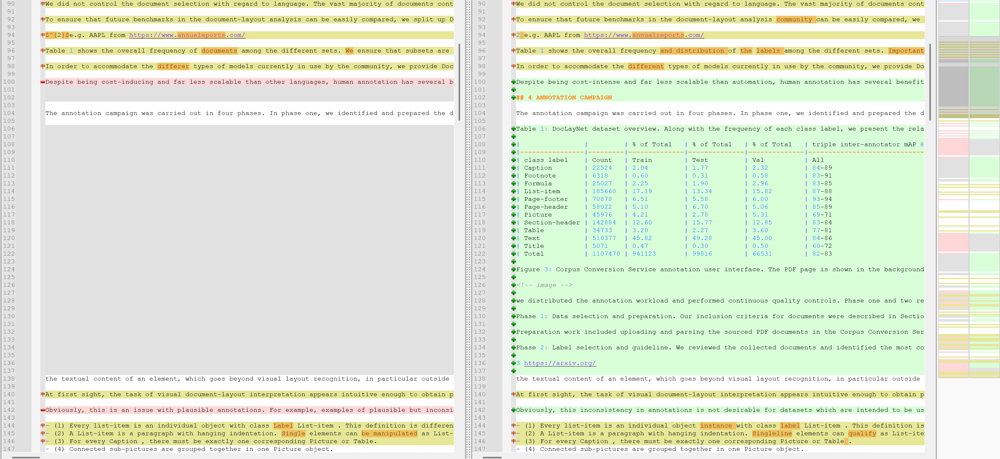
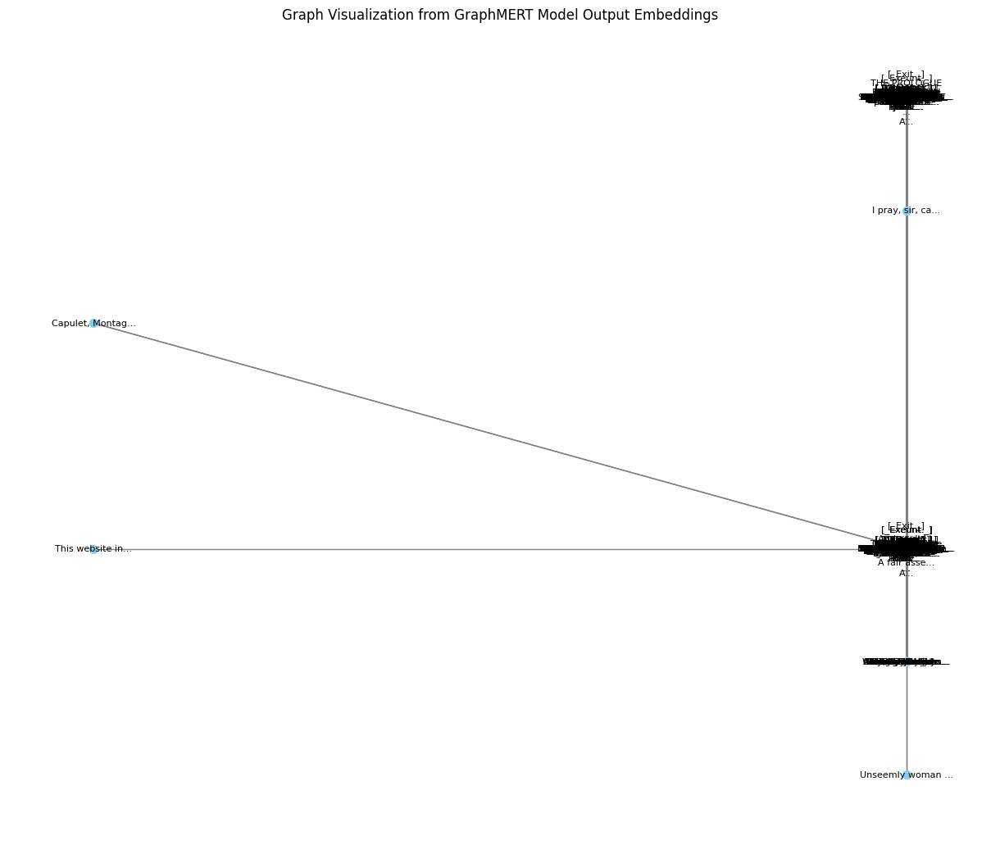

---

# Projektbericht: IMARA

## Domain-specific GraphRAG pipeline with model fine-tuning

**Modul:** Abschlussarbeit CAS Machine Learning for Software Engineers (ML4SE)

**Datum:** [Aktuelles Datum]

**Autoren:** Marco Allenspach, Lukas Koller, Emanuel Sovrano

## Abstract

Die Einführung von Retrieval-Augmented Generation (RAG) markierte einen bedeutenden Meilenstein in der Anwendung grosser Sprachmodelle (LLM), indem generative Fähigkeiten auf faktischen, externen Daten basierten, um Fehlinterpretationen zu vermeiden und die Relevanz zu erhöhen. Um die Schwächen von RAG der ersten Generation durch die Einführung strukturierter, relationaler Kontexte zu beheben, hat sich jedoch mit AI-Native GraphRAG ein weiterentwickeltes Paradigma etabliert.

Der rasante branchenweite Wandel hin zu graphenbasierten Architekturen ist eine notwendige Weiterentwicklung, die auf der Erkenntnis beruht, dass eine KI für effektives Denken ein Modell des Anwendungsbereichs benötigt, nicht nur eine Sammlung von Fakten. Der Fortschritt von unreflektierten LLMs zu grundlegenden RAGs löste das Problem der faktischen Fundierung, doch das Versagen rein vektorbasierter RAGs bei komplexen Anfragen zeigte, dass die Struktur des Wissens ebenso wichtig ist wie sein Inhalt. Ein Wissensgraph liefert diese Struktur und transformiert eine passive Dokumentensammlung in ein aktives, abfragefähiges Modell der Welt.

---

## 1. Management Summary

*(Ca. 0.5 - 1 Seite)*
Zusammenfassung des gesamten Projekts: Problemstellung (Extraktion aus komplexen PDFs), gewählter Lösungsansatz (GraphRAG & Fine-tuning) und die wichtigsten Ergebnisse des Benchmarkings.

Traditionelle neuronale Netze eignen sich gut zur Kodierung linearer Beziehungen, doch Daten aus der realen Welt sind in der Regel komplex und multidimensional. Graphen sind besser geeignet, höherdimensionale Verbindungen darzustellen, in denen jeder Knoten mit jedem anderen Knoten in Beziehung steht. Dadurch eignen sich Graphen besser zur Speicherung komplexer Beziehungen aus der realen Welt.

## 2. Einleitung und Zielsetzung

Das IMARA-Projekt hat zum Ziel, aufzuzeigen wie die Genauigkeit der Abfrage eines graph-basierten RAG-Systems sich verbessert.

Um eine Grundlage für die Messbarkeit zu haben, wurde OpenRAGBench als Referenzdatensatz ausgewählt.

### Defining the "AI-Native" GraphRAG Paradigm

AI-Native GraphRAG represents a specific and powerful subset of graph-based RAG systems. Solutions must automate the entire workflow from unstructured data to a natural language answer, abstracting complexities of graph theory and database management.

## naives RAG

### Die inhärenten Einschränkungen von vektorbasierter RAG

Konventionelle RAG-Architekturen verlassen sich auf Vektorsimilaritätssuche über ein Korpus von geteiltem Text. Dieser Ansatz behandelt Wissen als eine Sammlung von unzusammenhängenden Fakten und hat Schwierigkeiten mit Fragen, die erfordern:

- Synthese von Informationen aus mehreren Quellen
- Verständnis nuancierter Beziehungen zwischen Entitäten
- Durchführung von Multi-Hop-Reasoning
Der Kontext, der dem LLM bereitgestellt wird, ist oft eine Liste von Textausschnitten, die keine explizite Darstellung ihrer Verbindungen enthalten.

#### Kontextuelle Fragmentierung und Blindheit

Das Chunking bricht den natürlichen Informationsfluss willkürlich. Relevanter Kontext kann über verschiedene Chunks, Dokumente oder Abschnitte verstreut sein. Die Vektorsuche, die die Anfrage mit jedem Chunk einzeln vergleicht, versagt oft dabei, diesen vollständigen, verteilten Kontext abzurufen, was zu unvollständigen oder oberflächlichen Antworten führt. Sie versteht semantische Ähnlichkeit, ist jedoch blind für explizite Beziehungen wie Kausalität, Abhängigkeit oder Hierarchie.

#### Empfindlichkeit gegenüber der Chunking-Strategie

Die Leistung ist hochgradig empfindlich gegenüber der Chunking-Strategie (z.B. Chunk-Grösse, Überlappung). Suboptimale Strategien können übermässiges Rauschen einführen (Chunks zu gross) oder kritischen Kontext verlieren (Chunks zu klein), was umfangreiche und brüchige Anpassungen erfordert.

#### Unfähigkeit, Multi-Hop-Reasoning durchzuführen

Es gibt Schwierigkeiten, komplexe Fragen zu beantworten, die "Multi-Hop"-Reasoning erfordern. Zum Beispiel: "Welche Marketingkampagnen wurden von der in dem Q3-Bericht erwähnten Lieferkettenstörung betroffen?" erfordert die Verknüpfung von Störung → betroffene Produkte → Marketingkampagnen. Eine einfache Vektorsuche ist unwahrscheinlich, diese Informationssprünge zu überbrücken.

**Analogie:** Vektorbasierte RAG bietet einem Forscher einen Stapel isolierter Karteikarten, während GraphRAG darauf abzielt, eine umfassende Mindmap zu erstellen und bereitzustellen, die entscheidende Verbindungen aufdeckt.

### 2.1 Projekttitel: IMARA

### 2.2 Problemstellung

Die Extraktion und Verarbeitung von Informationen aus unstrukturierten PDF-Dokumenten stellt eine Herausforderung für herkömmliche RAG-Systeme dar.

### 2.3 Projektziele

- Die Implementation von graphbasierten System und der Vergleich zu klassischen RAG-Systemen
- Der Vergleich zwischen verschiedenen graphbasierten RAG-Systemen
-

-

**Graph-basiertes RAG:** Aufbau einer Pipeline zur Erstellung dichter Wissensgraphen.

-

**Model Fine-tuning:** Optimierung eines LLMs (z.B. Qwen) basierend auf dem Graph.

-

**Automation:** End-to-End Automatisierung der Pipeline.
Eine flexible Pipeline bauen, die bei der Evaluation der verschiedenen RAG-Systeme unterstützt.

## 3. Datenbasis und Vorverarbeitung

### 3.1 Datenquellen

Beschreibung der verwendeten Datensätze, wie z.B. der **Open RAG Bench Dataset** (Arxiv-Kategorien) oder **PubMedQA**.

### 3.2 PDF-Extraktion mit Docling

Einsatz des **Docling Toolkits** zur effizienten Konvertierung von Dokumenten in maschinenlesbare Formate (Markdown/JSON).

angetroffene Herausforderungen
**Challenge:** Die Qualität der Ergebnisse liegt unter den Erwartungen.

**Massnahme 1:** Optimierung der Parameter. Die optimierte Version der Parameter ist massiv schneller und viel genauer.

Die unterschiede sind z.T. ganze Tabellen.

Problematische Parameter:

erfolgreiche Parameter:

**Challenge:** Die 16GB VRAM waren nicht genug, um alle features von docling zu unterstützen. Das verursachte periodische Endless-loop's in Docling serve.
**Massnahme 1:** Der Verzicht auf die Container-Version "Docling serve" und die Verwendung direkt in Python.
**Massnahme 2:** Die Ausführung von Docling auf der CPU, um das VRAM-Limit zu umgehen

**Challenge:** Die 16GB VRAM waren nicht genug, um alle features von docling zu unterstützen. Das verursachte periodische Endless-loop's in Docling serve.
Die cloudcode_cli.exe in der VSCode-Umgebung hat durch einen etremen RAM-Verbrauch im Hintergrund die Ausführung von docling verhindert. freeze, not started, ... <https://forum.cursor.com/t/hight-memory-consumption-on-cloudcode-cli/106122>
**Massnahme 1:** Ein Uninstall von cloudcode_cli.exe war unumgänglich.

**Challenge:** Das parsen von Formeln in Docling mit CPU oder GPU ist sehr langsam. Den Verzicht auf die Extraktion der Formeln war keine Option, da eine maximale Qualität des Extrakts abgestrebt wurde, um die over-all Performance nicht zu beeinträchtigen.

Docling Log Ausschnitt:

    [WindowsPath('C:/Users/ML4SE/Desktop/openspec_demo/configs/data/OpenRAGBench/pdfs/2411.02951v2.pdf')]
    2025-12-17 19:08:35,249 - INFO - detected formats: [<InputFormat.PDF: 'pdf'>]
    2025-12-17 19:08:35,259 - INFO - Going to convert document batch...
    2025-12-17 19:08:35,260 - INFO - Processing document 2411.02951v2.pdf
    2025-12-18 01:37:07,514 - INFO - Finished converting document 2411.02951v2.pdf in 23312.29 sec.
    mpve the source file to the target directory
    2025-12-18 01:37:07,940 - INFO - Processed 1 docs, of which 0 failed and 0 were partially converted.
    2025-12-18 01:37:07,948 - INFO - Document conversion complete in 203589.20 seconds. it successfully completed 1 out of 287
    [WindowsPath('C:/Users/ML4SE/Desktop/openspec_demo/configs/data/OpenRAGBench/pdfs/2411.03001v2.pdf')]
    2025-12-18 01:37:07,968 - INFO - detected formats: [<InputFormat.PDF: 'pdf'>]
    2025-12-18 01:37:07,972 - INFO - Going to convert document batch...
    2025-12-18 01:37:07,973 - INFO - Processing document 2411.03001v2.pdf
    2025-12-18 14:22:26,866 - INFO - Finished converting document 2411.03001v2.pdf in 45918.92 sec.
    mpve the source file to the target directory
    2025-12-18 14:22:27,152 - INFO - Processed 1 docs, of which 0 failed and 0 were partially converted.
    2025-12-18 14:22:27,160 - INFO - Document conversion complete in 249508.41 seconds. it successfully completed 1 out of 286
    [WindowsPath('C:/Users/ML4SE/Desktop/openspec_demo/configs/data/OpenRAGBench/pdfs/2411.03166v3.pdf')]
    2025-12-18 14:22:27,193 - INFO - detected formats: [<InputFormat.PDF: 'pdf'>]
    2025-12-18 14:22:27,201 - INFO - Going to convert document batch...
    2025-12-18 14:22:27,202 - INFO - Processing document 2411.03166v3.pdf
    2025-12-19 03:50:46,515 - INFO - Finished converting document 2411.03166v3.pdf in 48499.35 sec.
    mpve the source file to the target directory
    2025-12-19 03:50:47,201 - INFO - Processed 1 docs, of which 0 failed and 0 were partially converted.
    2025-12-19 03:50:47,229 - INFO - Document conversion complete in 298008.48 seconds. it successfully completed 1 out of 285
    [WindowsPath('C:/Users/ML4SE/Desktop/openspec_demo/configs/data/OpenRAGBench/pdfs/2411.03257v3.pdf')]
    2025-12-19 03:50:47,249 - INFO - detected formats: [<InputFormat.PDF: 'pdf'>]
    2025-12-19 03:50:47,257 - INFO - Going to convert document batch...
    2025-12-19 03:50:47,259 - INFO - Processing document 2411.03257v3.pdf
    2025-12-19 23:49:15,094 - INFO - Finished converting document 2411.03257v3.pdf in 71907.86 sec.
    mpve the source file to the target directory
    2025-12-19 23:49:17,939 - INFO - Processed 1 docs, of which 0 failed and 0 were partially converted.
    2025-12-19 23:49:18,034 - INFO - Document conversion complete in 369919.29 seconds. it successfully completed 1 out of 284

**Massnahme 1:**
Einen zweiten Rechner 100% dafür einsetzen.

## 4. Methodik und Architektur

### 4.1 Graph-Konstruktion

#### 4.1.1 LeanRAG Ansatz

Detaillierung der Triple-Extraktion und der hierarchischen Retrieval-Struktur.

- **Extraktion:** Umwandlung von Text in Entitäten und Relationen.
-

**Aggregation:** Semantische Aggregation zur Reduzierung von Redundanz.

### leanRAG Workflow

file_chunk.py

1. chunk raw input token-based with 512 Tokens and 64 Tokens overlap

#### **Method 1: CommonKG**

CommonKG/create_kg.py
2. create a list of match words (entities) for each chunk
3. create a list of "all entities" based on the match words without duplicates

1. "new triples" have "subject, predicate, object" triples init with coresponding reference to the chunk of origin
2. "next layer entities"
3. "new triples descriptions"

CommonKG/deal_triple.py
7. summarize descriptions => relation.jsonl

#### **Method 2: GraphRAG**

GraphExtraction/chunk.py
2. loads the chunks
3. performs a "triple extraction" => entity.jsonl, relation.jsonl

GraphExtraction/deal_triple.py
4. deal with duplicates of entries and relations

build_graph.py

1. generating embeddings
2. clustering lables (based on the embeddings)
3. layer 1 clustering
4. layer 2 clustering
5. building vector DB

#### 4.1.2 LinearRAG

LinearRAG: Linear Graph Retrieval-Augmented Generation on Large-scale Corpora - A relation-free graph construction method for efficient GraphRAG.

✅ Context-Preserving: Relation-free graph construction, relying on lightweight entity recognition and semantic linking to achieve comprehensive contextual comprehension.
✅ Complex Reasoning: Enables deep retrieval via semantic bridging, achieving multi-hop reasoning in a single retrieval pass without requiring explicit relational graphs.
✅ High Scalability: Zero LLM token consumption, faster processing speed, and linear time/space complexity.

**Graphbuilding:**

1. => load data
2. chunking data
3. get named entities - SpacyNER (Named Entity Recognition)
4. sentence splitting
5. get passages
6. get embeddings(sentences, entities, passages)
7. build graph
    => LinearRAG.graphml
    => ner_results.json
    => passage_embedding.parquet
    => dentence_embedding.parquet
    => entity_embedding.parquet

**Retreival:**

1. retrieval_results = qa(question)

### linearRAG Results

LinearRAG, Dataset: 2wikimultihop, Results with local GPT-OSS-20b Model

[passage] Loaded 658 records from ./import\2wikimultihop\passage_embedding.parquet
[entity] Loaded 40320 records from ./import\2wikimultihop\entity_embedding.parquet
[sentence] Loaded 21206 records from ./import\2wikimultihop\sentence_embedding.parquet

2025-12-09 12:16:23,189 - INFO - Evaluation Results:
2025-12-09 12:16:23,191 - INFO -   LLM Accuracy: 0.7350 (735.0/1000)
2025-12-09 12:16:23,191 - INFO -   Contain Accuracy: 0.7210 (721/1000)

LinearRAG, Dataset: 2wikimultihop, Results with online gpt-4o-mini Model

[passage] Loaded 658 records from ./import\2wikimultihop\passage_embedding.parquet
[entity] Loaded 40320 records from ./import\2wikimultihop\entity_embedding.parquet
[sentence] Loaded 21206 records from ./import\2wikimultihop\sentence_embedding.parquet
Retrieving: 100%|███████████████████████████████████████████████████████████████████████████████| 1000/1000 [02:43<00:00,  6.12it/s]
QA Reading (Parallel): 100%|████████████████████████████████████████████████████████████████████| 1000/1000 [03:48<00:00,  4.37it/s]
Evaluating samples: 100%|█████████████████████████████████| 1000/1000 [00:40<00:00, 24.70sample/s, LLM_Acc=0.639, Contain_Acc=0.693]
2025-12-09 13:34:30,325 - INFO - Evaluation Results:
2025-12-09 13:34:30,325 - INFO -   LLM Accuracy: 0.6390 (639.0/1000)
2025-12-09 13:34:30,325 - INFO -   Contain Accuracy: 0.6930 (693/1000)

LinearRAG, Dataset: 2wikimultihop, Results with remote gemma3:17b Model

[passage] Loaded 658 records from ./import\2wikimultihop\passage_embedding.parquet
[entity] Loaded 40320 records from ./import\2wikimultihop\entity_embedding.parquet
[sentence] Loaded 21206 records from ./import\2wikimultihop\sentence_embedding.parquet
Retrieving: 100%|███████████████████████████████████████████████████████████████████████████████████████████████| 1000/1000 [03:10<00:00,  5.24it/s]
QA Reading (Parallel): 100%|██████████████████████████████████████████████████████████████████████████████████| 1000/1000 [1:22:15<00:00,  4.94s/it]
Evaluating samples: 100%|█████████████████████████████████████████████████| 1000/1000 [03:24<00:00,  4.88sample/s, LLM_Acc=0.240, Contain_Acc=0.351]
2025-12-09 19:02:34,979 - INFO - Evaluation Results:
2025-12-09 19:02:34,980 - INFO -   LLM Accuracy: 0.2400 (240.0/1000)
2025-12-09 19:02:34,981 - INFO -   Contain Accuracy: 0.3510 (351/1000)

LinearRAG, Dataset: 2wikimultihop, Results with online gpt-4o Model

[passage] Loaded 658 records from ./import\2wikimultihop\passage_embedding.parquet
[entity] Loaded 40320 records from ./import\2wikimultihop\entity_embedding.parquet
[sentence] Loaded 21206 records from ./import\2wikimultihop\sentence_embedding.parquet
Retrieving: 100%|███████████████████████████████████████████████████████████████████████████████████████████████| 1000/1000 [03:00<00:00,  5.55it/s]
QA Reading (Parallel): 100%|████████████████████████████████████████████████████████████████████████████████████| 1000/1000 [03:29<00:00,  4.78it/s]
Evaluating samples: 100%|█████████████████████████████████████████████████| 1000/1000 [00:40<00:00, 24.96sample/s, LLM_Acc=0.590, Contain_Acc=0.755]
2025-12-09 19:32:14,264 - INFO - Evaluation Results:
2025-12-09 19:32:14,264 - INFO -   LLM Accuracy: 0.5900 (590.0/1000)
2025-12-09 19:32:14,265 - INFO -   Contain Accuracy: 0.7550 (755/1000)

LinearRAG, Dataset: hotpotqa, Results with local GPT-OSS-20b Model

[passage] Loaded 1311 records from ./import\hotpotqa\passage_embedding.parquet
[entity] Loaded 66846 records from ./import\hotpotqa\entity_embedding.parquet
[sentence] Loaded 38455 records from ./import\hotpotqa\sentence_embedding.parquet
Retrieving: 100%|██████████████████████████████████████████████████████████████████████████████████████████████████████████████| 1000/1000 [03:46<00:00,  4.42it/s]
QA Reading (Parallel): 100%|█████████████████████████████████████████████████████████████████████████████████████████████████| 1000/1000 [1:51:26<00:00,  6.69s/it]
Evaluating samples: 100%|████████████████████████████████████████████████████████████████| 1000/1000 [24:59<00:00,  1.50s/sample, LLM_Acc=0.771, Contain_Acc=0.662]
2025-12-10 20:59:41,463 - INFO - Evaluation Results:
2025-12-10 20:59:41,463 - INFO -   LLM Accuracy: 0.7710 (771.0/1000)
2025-12-10 20:59:41,463 - INFO -   Contain Accuracy: 0.6620 (662/1000)

LinearRAG, Dataset: musique, Results with local GPT-OSS-20b Model

[passage] Loaded 1354 records from ./import\musique\passage_embedding.parquet
[entity] Loaded 67532 records from ./import\musique\entity_embedding.parquet
[sentence] Loaded 39110 records from ./import\musique\sentence_embedding.parquet
Retrieving: 100%|██████████████████████████████████████████████████████████████████████████████████████████████| 1000/1000 [03:15<00:00,  5.13it/s]
QA Reading (Parallel): 100%|█████████████████████████████████████████████████████████████████████████████████| 1000/1000 [3:51:21<00:00, 13.88s/it]
Evaluating samples: 100%|████████████████████████████████████████████████| 1000/1000 [17:39<00:00,  1.06s/sample, LLM_Acc=0.642, Contain_Acc=0.317]
2025-12-11 02:00:28,341 - INFO - Evaluation Results:
2025-12-11 02:00:28,342 - INFO -   LLM Accuracy: 0.6420 (642.0/1000)
2025-12-11 02:00:28,342 - INFO -   Contain Accuracy: 0.3170 (317/1000)

LinearRAG, Dataset: medical, Results with local GPT-OSS-20b Model

[passage] Loaded 225 records from ./import\medical\passage_embedding.parquet
[entity] Loaded 9033 records from ./import\medical\entity_embedding.parquet
[sentence] Loaded 8985 records from ./import\medical\sentence_embedding.parquet
Retrieving: 100%|██████████████████████████████████████████████████████████████████████████████████████████████| 2062/2062 [06:03<00:00,  5.67it/s]
QA Reading (Parallel): 100%|███████████████████████████████████████████████████████████████████████████████████| 2062/2062 [10:51<00:00,  3.17it/s]
Evaluating samples: 100%|████████████████████████████████████████████████| 2062/2062 [01:26<00:00, 23.72sample/s, LLM_Acc=0.694, Contain_Acc=0.032]
2025-12-11 09:33:43,939 - INFO - Evaluation Results:
2025-12-11 09:33:43,939 - INFO -   LLM Accuracy: 0.6940 (1431.0/2062)
2025-12-11 09:33:43,939 - INFO -   Contain Accuracy: 0.0320 (66/2062)

#### 4.1.3 GraphMERT

GraphMERT: Effiziente und skalierbare Gewinnung zuverlässiger Wissensgraphen aus unstrukturierten Daten

Ein einfaches Beispiel für eine Testimplementierung des Princeton GraphMERT-Papers.

<https://arxiv.org/abs/2510.09580>

Seit fast drei Jahrzehnten erforschen Wissenschaftler Anwendungen neurosymbolischer künstlicher Intelligenz (KI), da symbolische Komponenten Abstraktion und neuronale Komponenten Generalisierung ermöglichen. Die Kombination beider Komponenten verspricht rasante Fortschritte in der KI. Dieses Potenzial konnte das Feld jedoch bisher nicht ausschöpfen, da die meisten neurosymbolischen KI-Frameworks nicht skalierbar sind. Zudem schränken die impliziten Repräsentationen und das approximative Schliessen neuronaler Ansätze Interpretierbarkeit und Vertrauen ein. Wissensgraphen (KGs), die als Goldstandard für die Repräsentation expliziten semantischen Wissens gelten, können die symbolische Seite abdecken. Die automatische Ableitung zuverlässiger KGs aus Textkorpora stellt jedoch weiterhin eine Herausforderung dar. Wir begegnen diesen Herausforderungen mit GraphMERT, einem kompakten, rein grafischen Encoder-Modell, das hochwertige KGs aus unstrukturierten Textkorpora und seinen eigenen internen Repräsentationen generiert.

GraphMERT und sein äquivalenter Wissensgraph bilden einen modularen neurosymbolischen Stack: neuronales Lernen von Abstraktionen; symbolische Wissensgraphen für verifizierbares Schliessen. GraphMERT + Wissensgraph ist das erste effiziente und skalierbare neurosymbolische Modell, das höchste Benchmark-Genauigkeit und überlegene symbolische Repräsentationen im Vergleich zu Basismodellen erzielt.

Konkret streben wir zuverlässige domänenspezifische Wissensgraphen (KGs) an, die sowohl (1) faktisch korrekt (mit Herkunftsnachweis) als auch (2) valide (ontologiekonsistente Relationen mit domänenspezifischer Semantik) sind. Wenn ein grosses Sprachmodell (LLM), z. B. Qwen3-32B, domänenspezifische KGs generiert, weist es aufgrund seiner hohen Sensitivität, seiner geringen Domänenexpertise und fehlerhafter Relationen Defizite in der Zuverlässigkeit auf. Anhand von Texten aus PubMed-Artikeln zum Thema Diabetes erzielt unser GraphMERT-Modell mit 80 Millionen Parametern einen KG mit einem FActScore von 69,8 %; ein LLM-Basismodell mit 32 Milliarden Parametern erreicht hingegen nur einen FActScore von 40,2 %. Der GraphMERT-KG erzielt zudem einen höheren ValidityScore von 68,8 % gegenüber 43,0 % beim LLM-Basismodell.

**GraphMERT Node Embeddings (t-SNE View)**

**GraphMERT Semantic Graph Visualization**

**Query search on the graphs results**
Das ist es, was wir wollen, da die Suche im Graphen linear ist und auf verkettetem Wissen basiert, wobei die Knoten Daten über sich selbst enthalten.

***Ein perfektes Resultat***

***Ein fast perfektes Resultat***

- **Extraktion:** Umwandlung von Text in Entitäten und Relationen.
-

**Aggregation:** Semantische Aggregation zur Reduzierung von Redundanz.

### 4.2 Fine-tuning Strategie

- Verwendung des **Unsloth Frameworks** für ressourceneffizientes Training.

- Integration von Ansätzen wie **GraphRAFT** oder **GraphMERT** zur Distillation von Wissen in kleine, domänenspezifische Modelle.

## 5. Implementierung

### 5.1 Systemarchitektur

Beschreibung der Pipeline von der PDF-Eingabe bis zur Antwortgenerierung.

### 5.2 Verwendete Hardware

Dokumentation der genutzten Ressourcen (z.B. 1x 4090 Desktop, M3 Pro 24GB) .
1 HP EliteBook X G11  => Massenextraktion mit Docling
Prozessor Intel 5U

1 Lenovo Notbook Legion 9 16IRX8
Prozessor 13th Gen Intel(R) Core(TM) i9-13980HX (2.20 GHz)
Installierter RAM 32.0 GB (31.7 GB verwendbar)
GPU     Nvidia RTX4090 Mobile mit 16GB VRAM

## 6. Evaluation und Benchmarking

### 6.1 Benchmark-Design

-

**Ansatz 1:** Generierung eines Testdatensatzes mittels Synthetic Data Generation (SDG) und Evaluierung durch ein "LLM als Judge".

-

**Ansatz 2:** Nutzung publizierter Benchmarks wie dem Open RAG Benchmark.

### 6.2 Ergebnisse

Vergleich der Performance: Standard RAG vs. IMARA GraphRAG vs. Fine-tuned Model.

## 7. Diskussion der Ergebnisse

- Qualität der generierten Graphen.

- Effektivität des Fine-tunings im Vergleich zu GPT-basierten Modellen.

- Ressourcenverbrauch und Skalierbarkeit.

## 8. Risikomanagement und Lessons Learned

Reflektion über die im Antrag identifizierten Risiken:

- Datenqualität und Graph-Dichte.

- Rechenintensität des Fine-tunings.

- Teamkoordination.

## 9. Fazit und Ausblick

Zusammenfassung, ob ein 80M domänenspezifisches Modell tatsächlich größere Modelle übertreffen konnte, und mögliche nächste Schritte.

## 10. Referenzen

- [1] Docling: An Efficient Open-Source Toolkit.

- [2] LeanRAG: Knowledge-Graph-Based Generation.

- [3] GraphMERT: Efficient Distillation of Reliable KGs.

- ... (Weitere Quellen gemäß Antrag).

## 11. Glossar

xxx

---

### Tipps für die Ausarbeitung

- **Visualisierungen:** Nutzt die Grafiken aus eurem Zwischenbericht (LeanRAG/Docling Architektur), um die technischen Sektionen (Kapitel 3 & 4) zu füllen.
- **Code-Beispiele:** Fügt kurze Snippets eurer Automatisierungslösung oder der Unsloth-Konfiguration in Kapitel 5 ein.
- **Metriken:** In Kapitel 6 solltet ihr Tabellen mit Latenzzeiten und Genauigkeitswerten (Accuracy/F1) eurer Benchmarks zeigen.

**Soll ich dir beim Ausformulieren eines spezifischen Kapitels (z.B. der Methodik oder der Evaluation) behilflich sein?**
