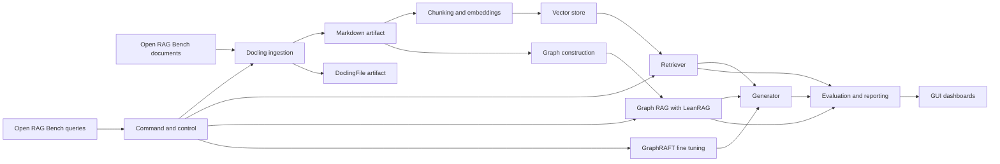

# Imara Project — What v3

A domain-specific Graphbased RAG pipeline with model fine-tuning, refined from what5.md. This version implements a fully local hosting model to comply with highly sensitive data and data protection laws.

## Vision
Deliver a production-ready knowledge graph powered RAG pipeline where:
- Documents are ingested and normalized with Docling.
- Documents are further chunked with different chunking strategies.
- Chunk are later vetorized with different embedding models.
- Retrieval is performed both via a lean baseline and graph-enhanced RAG using LeanRAG as starting point.
- The model is improved via graph-aware fine-tuning using GraphRAFT.
- Quality is quantified with Open RAG Bench at scale.
- Orchestration supports stepwise and end-to-end workflows, available via CLI and API, and surfaced in a GUI.

## Modules
- Command and control
- Test dataset management
- Data ingestion
- Chunking
- Embedding
- Naive RAG
- Graph RAG
- Graph-based model fine-tuning
- Benchmarking
- Graphical user interface

## External Repositories
- Docling: https://github.com/docling-project/docling
- LeanRAG: https://github.com/KnowledgeXLab/LeanRAG
- NaiveRAG reference: https://milvus.io/docs/de/build-rag-with-milvus.md or https://github.com/tobiashaab/NaiveRAG
- GraphRAFT: https://github.com/AlfredClemedtson/graphraft
- Test dataset Open RAG Bench: https://github.com/vectara/open-rag-bench

## End-to-End Flow

## Functional Requirements
Each of the requirements SHALL be in a separate packadge.

the over all strategy is composed of following ideas:
- each source file will get its own folder to store its processing steps.
- to the ability of modifying the processing workflow, each step, like text extraction, chunking and so on, is stored in the source file structure. 

### 1. Data Ingestion with Docling
- The system SHALL ingest the Open RAG Bench documents and normalize them using Docling.
- For each extraction, the system SHALL produce:
  - A Markdown artifact representing the readable content.
  - A DoclingFile artifact containing structured extraction and metadata, referenced artifacts, tables, code, formulas and images with their classification and description
  - A Doctags file as possible source for later model finetuning.
- The system SHALL enrich artifacts with metadata including a stable document id, source uri, checksum, language, page count, and ingestion timestamp.
- The system SHALL support configurable chunk size and overlap for downstream embedding. the default chuncking method is the "Hierarchical Chunker"
- The system SHALL support different chunking methods in parallel for downstream performance comparison. 
- The system SHALL log failures per document with error codes and retriable flags.
- The ingestion module SHALL operate independently and be invocable on its own.

Acceptance checks
- Given a valid input document, WHEN processed, THEN the Markdown artifact and the DoclingFile artifact are created and stored with metadata.
- Given an unsupported format, WHEN processed, THEN the system emits a clear, actionable error and continues with remaining items.
- Given a list of input documents, WHEN processed, THEN the error of one input document will not stop the futher processing of the rest of the list.

### 2. Naive RAG
- The system SHALL provide a baseline RAG that performs similarity search over the embedded chunks and generates answers using retrieved contexts.
- The baseline SHALL be invocable independently and optionally run in parallel with graph RAG for comparison.
- The system SHALL provide a separate collection of vectors for each job where the collection id is equals the jobId.
Acceptance checks
- Given a query, WHEN executed, THEN top k passages and an answer are returned along with confidence and latency metrics.

### 3. Graph RAG with LeanRAG
- The system SHALL integrate LeanRAG as the core implementation for graph enhanced retrieval and generation.
- LeanRAG SHALL accept Markdown artifacts from ingestion as input sources.
- The system SHALL construct or import a knowledge graph from the Markdown content and use it to augment retrieval and response synthesis.

Acceptance checks
- Given ingested documents and a query, WHEN executed via LeanRAG, THEN the system returns an answer plus supporting graph contexts and provenance.

### 4. Graph-based Model Fine-Tuning
- The system SHALL perform graph-aware fine-tuning using GraphRAFT to improve answer quality and grounding.
- Training data SHALL be derived from the knowledge graph and past retrieved contexts with labels tied to the Open RAG Bench answers where available.
- The fine-tuned model SHALL be pluggable in both naive and graph RAG pipelines.

Acceptance checks
- Given a training configuration, WHEN fine-tuning completes, THEN the resulting model achieves equal or better scores than the base model on the benchmarking suite.

### 5. Benchmarking with Open RAG Bench
- The system SHALL use the Open RAG Bench dataset consisting of approximately 1000 PDFs and 3000 queries for evaluation.
- The benchmark runner SHALL support batch execution, checkpointing, and resumption.
- Metrics SHALL include answer quality, faithfulness to source, retrieval recall at k, latency, and cost where applicable.

Acceptance checks
- Given a set of queries, WHEN the benchmark runs, THEN metrics are computed and persisted per system variant and configuration.

### 6. Command and Control
- The system SHALL provide CRUD functionality for jobs.
- The system SHALL keep track of each jobs progress.
- The system SHALL allow to add or remove input documents with the nessecary updates of the processing steps downstream. 
- The syste SHALL allow the change of the workflow at any time with the nessecary updates of the processing steps downstream. 
- The system SHALL provide orchestration to run individual steps, partial flows, or full pipelines.
- Steps SHALL run independently and asynchronously with dependency-aware scheduling.
- Interfaces SHALL include a CLI and an HTTP API for job submission, status, cancellation, and artifact discovery.
- The controller SHALL persist job metadata, parameters, metrics, and artifacts locations.
- The system SHALL maintains a backlog of all pending execution steps for each job.

Acceptance checks
- Given a pipeline definition and inputs, WHEN a job is submitted, THEN status transitions, logs, metrics, and outputs are accessible via CLI and API.

### 7. Graphical User Interface
- The GUI SHALL surface capabilities of the command and control component via API.
- The GUI SHALL provide pages for ingestion monitoring, search and QnA, graph RAG inspection, benchmark results, and model management.
- The GUI SHALL reflect the workflow from left to right; Job Management, Ingestion, Chunking, Embedding, Vector Database, Naive RAG, Graphbased RAG, Graph-based model fine-tuning, Benchmarking and Settings.
- The GUI SHALL support visualization of graph contexts and provenance.

Acceptance checks
- Given completed runs, WHEN viewed in the GUI, THEN users can inspect inputs, contexts, answers, metrics, and artifacts.

## Non-Functional Requirements
### 8. Vector Store: Milvus
- The system SHALL use Milvus as the standard vector database, accessed via PyMilvus.
- Collections SHALL be partitioned by dataset corpus; every record SHALL include metadata fields: doc_id, section_id, language, source_uri, checksum, and created_at.
- Index configuration SHALL default to HNSW with cosine distance (recommended M=16, efConstruction=200), with IVF_FLAT as a supported alternative. The embedding dimension MUST match the selected embedding model.
- Upsert semantics: embeddings SHALL be written with ids in the form doc_id:chunk_id; re-ingestion SHALL replace prior records; deletions SHALL remove all affected chunk ids; periodic compaction SHALL be enabled.
- Retrieval SHALL support metadata filters (e.g., by doc_id, language) and a configurable top_k; default k=5.
- Backups and snapshots SHALL be stored in local object storage (e.g., MinIO) with encryption at rest; restores SHALL be validated via checksum.
- Observability: export QPS, latency, recall@k probes, and disk usage metrics; alerts on degraded index health or compaction backlog.

Acceptance checks
- Given a set of chunk embeddings, WHEN upserted, THEN Milvus returns them in vector search with correct metadata filters applied.
- Given a query vector, WHEN searched, THEN the top-k nearest chunks are returned within the latency SLO and include doc_id and section_id for provenance.
- Configurability: All modules SHALL be configurable via environment and runtime parameters with sane defaults.
- Observability: Modules SHALL emit structured logs, metrics, and traces suitable for dashboards.
- Reproducibility: Pipeline runs SHALL be deterministic given the same inputs and seeds.
- Security: Sensitive data SHALL be redacted from logs, and API access SHALL be authenticated.

### 9. File ingestation: Docling
- The system SHALL use docling as local. https://github.com/docling-project/docling
- the system SHALL use the following parameter set:
    -   picture_description_api = {
            "url": "http://localhost:11434/v1/chat/completions", 
            "headers": {},	            # Dict[str, str]	Headers used for calling the API endpoint. For example, it could include authentication headers.      
            "params": {                 # Dict[str, Any]	Model parameters.
                "model": "granite3.2-vision:2b",
            },
            "timeout": 200.0,	        # float	            Timeout for the API request.
            "concurrency": 2,	        # int	            Maximum number of concurrent requests to the API.
            "prompt": "Describe this image in great details.",	    # str	            Prompt used when calling the vision-language model.
        }
  
        parameters = {
            "from_formats": ["docx", "pptx", "html", "image", "pdf", "asciidoc", "md", "xlsx"],
            "to_formats": ["md", "json", "html", "text", "doctags"], # Option "html_split_page"
            "image_export_mode": "referenced", # Allowed values: placeholder, embedded, referenced. Optional, defaults to embedded.
            "target_type": "zip",
            "do_ocr": True,
            "force_ocr": False,
            "ocr_engine": "easyocr",
            "ocr_lang": ["en"],
            "pdf_backend": "dlparse_v4",
            "table_mode": "accurate",
            "abort_on_error": False,
            "do_table_structure": True, # default is True 
            "include_images": True, # default is True 
            "do_code_enrichment": True, # default is False
            "do_formula_enrichment": True, # default is False
            "do_picture_classification": True,  # default is False
            "do_picture_description": True, # default is False
            "picture_description_api": picture_description_api,
        } 
- The system SHALL expose all the docling parameters to the config.yaml
- The system SHALL provide docling serve as an option.
  - docling serve
    - Detail instructions can be obtained from https://github.com/docling-project/docling-serve
    - use only the Asynchronous API

## Evaluation Metrics
- Answer quality and faithfulness to sources.
- Retrieval recall at k and precision at k.
- Latency p50 and p95 per stage and end to end.
- Token or compute cost per answer where applicable.
- Uptime and failure rates per module.

## Risks and Mitigations
- Quality drift: Schedule periodic benchmark runs and alert on regressions.
- Cost and latency: Cache embeddings and retrieval results, use smaller embedding models where possible.
- Graph complexity: Limit graph schema initially and expand based on measured gains.

## Hosting Model for Generator and Fine-tuned Variants (Local Only)
To comply with highly sensitive data and data protection laws, all model inference and fine-tuning will be performed locally:

- **Local Inference Backend**: 
  - Deploy the primary LLM (e.g., Llama-3.1-8B) using vLLM on dedicated GPU nodes (e.g., NVIDIA L4 or A10) within a private cluster.
  - Serve via OpenAI-compatible API endpoints (e.g., /v1/chat/completions) for integration with both naive RAG and Graph RAG.
  - Use LoRA/QLoRA adapters for fine-tuned variants, stored in local object storage (e.g., MinIO) with versioned manifests.
  - Hot-swap LoRA adapters via vLLM's multi-LoRA serving capability (select via request parameter).
  - Implement persistent storage for model weights on local NVMe or object store cache with warm startup via initContainer.

- **Fine-tuning Environment**:
  - Run GraphRAFT fine-tuning on the same local GPU infrastructure.
  - Store fine-tuned models and adapters in local storage.
  - Ensure all training data and model artifacts remain within the private network.

- **Security and Compliance**:
  - All data and model artifacts are stored and processed within the private cluster.
  - Network egress is restricted to prevent data leakage.
  - Use mTLS/TLS termination at the API gateway for secure communication.
  - Implement per-tenant API keys and signed request policies.
  - Artifact integrity: checksum LoRA adapters; signed model manifests.

- **Scalability and Performance**:
  - Horizontal Pod Autoscaler on tokens/sec (egress) and queue depth.
  - Set max concurrent requests per GPU based on target latency and context length.
  - Use KV-cache reuse and 4-bit/8-bit quantization where acceptable.
  - Pin max context length to the RAG window used by LeanRAG.
  - Cache completions for repeated benchmark prompts and warm popular adapters.

- **Cost/latency Strategy**:
  - Start with Llama-3.1-8B/Mistral-7B class for RAG (fast on single L4), scale up only if Open RAG Bench shows a measurable win.
  - Use local storage for all model artifacts to avoid external dependencies.

This local-only hosting model ensures complete data sovereignty and compliance with data protection regulations while maintaining performance and scalability for the RAG pipeline.

## Open Questions
- Embedding model choices and language coverage requirements.

## Milestones
- M1: Job and workflow management with GUI-support.
- M2: Ingestion and artifacts with Docling.
- M3: Flexible chunking with Docling.
- M4: Flexible Chunking with different Embedding models.
- M4: Naive RAG baseline with metrics.
- M6: Graph RAG via LeanRAG with provenance.
- M7: GraphRAFT fine-tuning and A B comparison.
- M8: Benchmark automation on Open RAG Bench.
- M9: GUI for monitoring and exploration.

